# Docling Japanese Books - Document Processing Pipeline

[](https://github.com/paazmaya/docling-japanese-books/actions/workflows/ci.yml)

A streamlined document processing tool that uses [Docling](https://github.com/docling-project/docling) to extract, process, and store Japanese books and documents for LLM training workflows.

**See the amount of emojis used in this documentation? Sure, this has initially been vibe-coded during an evening...**


## Overview

This project provides a robust, opinionated pipeline for:

- **Document Ingestion**: Batch processing of documents in various formats (PDF, DOCX, HTML, etc.)
- **Content Extraction**: Using Docling's advanced document understanding capabilities with IBM Granite Vision 3.3 2B
- **Image Processing**: Extract and annotate images with SHA-256 hashing for deduplication
- **Vector Storage**: [Milvus](https://milvus.io/) Lite database with enhanced metadata including image references
- **LLM Training Preparation**: Optimized chunking and serialization for training data

## Key Features

- 📄 **Multi-format Support**: PDF, DOCX, PPTX, HTML, Markdown, TXT, and images
- 🔧 **Advanced Processing**: Table extraction, OCR, structure preservation
- �️ **Vision Model Integration**: IBM Granite Vision 3.3 2B for image annotation with Japanese-optimized prompts
- 🖼️ **Smart Image Handling**: SHA-256 based filenames for deduplication, separate storage with metadata
- 🗂️ **Vector Database**: Milvus Lite with enhanced schema including image metadata
- 🤖 **LLM Ready**: BGE-M3 embeddings with Late Chunking optimization for Japanese content
- 🧪 **Embedding Evaluation**: Real-document testing with automatic PDF processing from `test_docs/` ([BGE-M3](https://huggingface.co/BAAI/bge-m3), [Snowflake Arctic](https://huggingface.co/Snowflake/snowflake-arctic-embed-l-v2.0), [Jina v4](https://huggingface.co/jinaai/jina-embeddings-v4), [all-MiniLM-L6-v2](https://huggingface.co/sentence-transformers/all-MiniLM-L6-v2))
- ⚡ **Batch Processing**: Efficient processing with Rich progress tracking
- 🎯 **Zero Configuration**: Hardcoded settings optimized for Japanese documents
- 📊 **Rich CLI**: Beautiful progress bars and comprehensive commands
- 🛠️ **Modern Tooling**: Built with uv, ruff, and complete type hints
- 📦 **Local Model Management**: Download and cache models in project directory

## Architecture

```mermaid
flowchart TD
  A[📁 Input Documents] --> B{Document Type}
  B -->|PDF, DOCX, PPTX| C[🔧 Docling Processing]
  B -->|HTML, MD, TXT| C
  B -->|Images| C

  C --> D[📝 Text Extraction]
  C --> E[🖼️ Image Extraction]
  C --> F[📊 Table Extraction]

  D --> G[🧠 IBM Granite Vision 3.3B]
  E --> H[🔐 SHA-256 Hashing]
  F --> D

  G --> I[📖 Japanese Text Analysis]
  H --> J[🗂️ Deduplicated Storage]

  I --> K[✂️ Hierarchical Chunking]
  J --> L[💾 Image Repository]

  K --> M{🧮 Embedding Model}
  M --> M1[🔹 Jina v4]
  M --> M2[🔸 BGE-M3]
  M --> M3[🔸 Snowflake Arctic]
  M --> M4[🔸 all-MiniLM-L6-v2]
  L --> N[📋 Image Metadata]

  M1 --> O{🗄️ Database Provider}
  M2 --> O
  M3 --> O
  M4 --> O
  N --> O

  O --> O1[(🔍 Milvus Lite)]
  O --> O2[(☁️ Zilliz Cloud)]

  O1 --> P[📄 JSON Export]
  O1 --> Q[📝 Markdown Export]
  O1 --> R[📦 JSONL Chunks]
  O1 --> S[🔍 Vector Search]
  O2 --> P
  O2 --> Q
  O2 --> R
  O2 --> S

  style A fill:#e1f5fe
  style O1 fill:#f3e5f5
  style O2 fill:#e0f7fa
  style G fill:#fff3e0
  style H fill:#e8f5e8
  style M1 fill:#e8eaf6
  style M2 fill:#fce4ec
  style M3 fill:#f3e5f5
  style M4 fill:#e0f2f1
```



## Installation

### Prerequisites

- Python 3.9+
- [uv](https://github.com/astral-sh/uv) for dependency management
- Internet connection (for model downloads)
- ~7GB free disk space (for models)
- Docker

### Setup

https://milvus.io/docs/install_standalone-docker-compose-gpu.md

http://localhost:9091/webui/

```sh
docker compose up -d
```

#### Option 1: Development Installation (Recommended)

```bash
# Clone the repository
git clone git@github.com:paazmaya/docling-japanese-books.git
cd docling-japanese-books

# Install uv if not already installed
curl -LsSf https://astral.sh/uv/install.sh | sh

# Install dependencies and package in development mode
uv sync

# Download all required models (this will take ~30 minutes)
uv run docling-japanese-books download

# Verify installation with test documents
uv run docling-japanese-books process test_docs/
```

#### Option 2: Package Installation (Future)

Once published to PyPI, users will be able to install directly:

```bash
# Install from PyPI (when available)
pip install docling-japanese-books

# Or with uv
uv add docling-japanese-books

# Then use directly (no uv run needed)
docling-japanese-books download
docling-japanese-books process documents/
docling-japanese-books search "query text"
```

### Model Information

**Tokenization**: Uses **IBM Granite Docling 258M** model ([`ibm-granite/granite-docling-258M`](https://huggingface.co/ibm-granite/granite-docling-258M)) for document-aware tokenization.

**Vision Processing**: Uses **IBM Granite Vision 3.3 2B** model ([`ibm-granite/granite-vision-3.3-2b`](https://huggingface.co/ibm-granite/granite-vision-3.3-2b)) for image annotation with Japanese-optimized prompts.

**Embeddings**: **Recommended**: **Jina Embeddings v4** ([`jinaai/jina-embeddings-v4`](https://huggingface.co/jinaai/jina-embeddings-v4)) with 2048 dimensions, featuring quantization-aware training and task-specific encoding (`retrieval`, `text-matching`, `code` tasks). Shows 225% average improvement over traditional models.

**Alternative**: **BAAI/bge-m3** model ([`BAAI/bge-m3`](https://huggingface.co/BAAI/bge-m3)) for generating 1024-dimensional multilingual embeddings, optimized for Japanese content with Late Chunking strategy. Shows 98.9% improvement over traditional models.

All models are downloaded to `.models/` directory in the project root for reuse.

### Database and Storage

- **Vector Database**: Stored locally in `.database/docling_documents.db` (Milvus Lite)
- **Images**: Stored in `./output/images/[document_name]/` with SHA-256 filenames
- **Models**: Cached in `.models/` directory (excluded from git)

Benefits of local storage:

- ✅ **Self-contained**: Everything stays in project directory
- ✅ **Version control friendly**: Database and models excluded from git
- ✅ **Easy backup**: Copy entire project directory
- ✅ **No conflicts**: Each project has its own data

## Quick Start

### Command Overview

The CLI is available as `docling-japanese-books` console script and provides three main commands:

> **Note**: In development mode, use `uv run docling-japanese-books`. When installed as a package, you can use `docling-japanese-books` directly.

```bash
# Download all required models (run once)
uv run docling-japanese-books download [--verbose] [--force]

# Process documents with image extraction and vector storage
uv run docling-japanese-books process DIRECTORY [--verbose] [--dry-run]

# Search the vector database
uv run docling-japanese-books search "query text" [--limit 10] [--verbose]

# Evaluate embedding models for Japanese content
uv run docling-japanese-books evaluate [--output results.json] [--documents docs.json] [--verbose]

# Compare all 4 embedding models (uses all PDFs in test_docs/)
# Models: Traditional (all-MiniLM-L6-v2), BGE-M3, Snowflake Arctic Embed L v2.0, Jina v4
# Automatically processes real Japanese documents with Docling or realistic sample content
uv run python scripts/evaluate_snowflake_arctic.py

# Configure database connection (local or cloud)
uv run docling-japanese-books config-db [--mode local|cloud] [--test-connection] [--verbose]
```

### Processing Documents

```bash
# Process test documents (includes Japanese karate book PDF)
uv run docling-japanese-books process test_docs/

# Dry run to see what would be processed
uv run docling-japanese-books process documents/ --dry-run

# Process with verbose logging
uv run docling-japanese-books process documents/ --verbose
```

### Searching Content

```bash
# Search for content
uv run docling-japanese-books search "martial arts techniques"

# Limit results
uv run docling-japanese-books search "karate" --limit 3

# Search with verbose output
uv run docling-japanese-books search "Japanese text" --verbose
```

### Managing Models

```bash
# Download all models with progress tracking
uv run docling-japanese-books download

# Force re-download (if models are corrupted)
uv run docling-japanese-books download --force

# Download with detailed logging
uv run docling-japanese-books download --verbose
```

### Evaluating Embedding Performance

The evaluation system compares embedding models using real Japanese documents from the `test_docs/` directory:

```bash
# Run BGE-M3 vs traditional evaluation with real documents
uv run docling-japanese-books evaluate

# Compare all 4 embedding models including Jina v4 (uses all PDFs in test_docs/)
uv run python scripts/evaluate_snowflake_arctic.py

# Use custom documents for evaluation
uv run docling-japanese-books evaluate --documents my_japanese_docs.json

# Save results to specific file
uv run docling-japanese-books evaluate --output detailed_results.json --verbose
```

### Advanced Model Comparison: Snowflake Arctic Embed

We've evaluated the highly-praised **Snowflake Arctic Embed L v2.0** model ([`Snowflake/snowflake-arctic-embed-l-v2.0`](https://huggingface.co/Snowflake/snowflake-arctic-embed-l-v2.0)) against our current BGE-M3 implementation and other leading models:

```bash
# Run comprehensive 4-model comparison
uv run python scripts/evaluate_snowflake_arctic.py
```

**Comprehensive Comparison Results (Real Japanese Documents, October 2025):**

| Model                         | Mean Score | Std Dev | Improvement over Traditional |
| ----------------------------- | ---------- | ------- | ---------------------------- |
| Traditional (MiniLM-L6-v2)    | 0.197      | 0.033   | baseline                     |
| BGE-M3 (Late Chunking)        | 0.417      | 0.026   | +116.0% ± 30.1%              |
| Snowflake Arctic Embed L v2.0 | 0.174      | 0.025   | -10.3% ± 14.9%               |
| Jina Embeddings v4            | 0.579      | 0.020   | +201.4% ± 48.7%              |

| Document                                                                             | Traditional | BGE-M3 (Late Chunking) | Snowflake Arctic | Winner             |
| ------------------------------------------------------------------------------------ | ----------- | ---------------------- | ---------------- | ------------------ |
| toyoma-okugi1956                                                                     | 0.214       | 0.405 (+89.5%)         | 0.191 (-10.6%)   | Jina Embeddings v4 |
| 広島県武術家伝\_1939799_0001                                                         | 0.151       | 0.381 (+151.5%)        | 0.139 (-8.4%)    | Jina Embeddings v4 |
| 薙刀体操法\_860420_0001                                                              | 0.239       | 0.437 (+82.9%)         | 0.162 (-32.0%)   | Jina Embeddings v4 |
| 集住と余暇より生まれるコミュニティ活動からみた生活空間計画に関する研究\_3143445_0001 | 0.186       | 0.446 (+140.1%)        | 0.204 (+9.9%)    | Jina Embeddings v4 |

**Key Findings:**

- ✅ **Jina Embeddings v4** dominates with 100% wins on real Japanese documents
- 🎯 **Exceptional performance** on technical and historical content (+265.4% best improvement)
- 📚 **BGE-M3 + Late Chunking** shows strong improvement (+116.0% average) and excellent context preservation
- 📉 **Snowflake Arctic** underperforms traditional models (-10.3% average) on Japanese content
- 🌐 **Quantization advantage**: Jina v4's quantization-aware training shows clear benefits (+201.4% average)
- 💡 **Task-specific encoding**: Jina v4's retrieval task specification crucial for Japanese texts
- 📜 **Dynamic evaluation**: New documents added to `test_docs/` are automatically included

**Recommendation:**

- Upgrade to **Jina Embeddings v4** for Japanese document processing workflows
- Use **BGE-M3 + Late Chunking** as a strong alternative for context preservation

**Next Steps:**

- Implement Jina Embeddings v4 as the primary embedding model
- Leverage quantization-aware training for Japanese text
- Test on larger document collections to validate performance

## Configuration

This tool uses hardcoded configurations optimized for Japanese document processing:

### Document Processing (Docling)

- **Supported formats**: PDF, DOCX, PPTX, HTML, Markdown, TXT, Images
- **Max file size**: 100MB per document
- **Max pages**: 1000 pages per document
- **OCR**: Enabled by default (auto-detects best engine)
- **Table extraction**: Enabled with cell matching
- **Vision models**: IBM Granite Vision 3.3 2B available (currently disabled due to path configuration issues)
- **Image processing**: 2x scale, extract and annotate separately

### Vision Model Settings

- **Model**: `ibm-granite/granite-vision-3.3-2b`
- **Prompt**: Optimized for Japanese documents
  ```
  "Describe this image from a Japanese document. Focus on any Japanese text,
   illustrations, diagrams, or cultural elements. Be detailed and specific."
  ```
- **Image storage**: SHA-256 hash filenames in `./output/images/[document]/`
- **Metadata**: Includes image hash references in vector database

### Chunking & Tokenization

- **Tokenizer**: `ibm-granite/granite-docling-258M` (document-aware)
- **Embeddings**: `BAAI/bge-m3` (1024 dimensions, multilingual with Japanese support)
- **Strategy**: Late Chunking for improved context preservation
- **Traditional Fallback**: Hierarchical chunking with image references
- **Max tokens per chunk**: 512 (traditional) / 800 (Late Chunking)
- **Overlap**: 50 tokens
- **Min chunk length**: 20 tokens
- **Image integration**: Text chunks include references to extracted images

#### 🚀 **Late Chunking Optimization**

Inspired by [Milvus research](https://milvus.io/blog/smarter-retrieval-for-rag-late-chunking-with-jina-embeddings-v2-and-milvus.md), we implemented Late Chunking for superior context preservation:

1. **Embed First**: Process full document with global context
2. **Chunk Later**: Extract contextualized chunk embeddings
3. **Japanese Optimized**: BGE-M3 model with multilingual training

**Performance Results** (tested on Japanese documents):

- 📈 **199.7% average improvement** in Japanese query matching
- 🎯 Best improvement: **+353.2%** on technical documentation
- 🧠 Context preservation: Maintains cross-sentence relationships
- 🌐 Multilingual: Superior handling of Japanese grammar and cultural context

### Vector Database (Milvus/Zilliz Cloud)

- **Deployment Options**:
  - 🏠 **Local**: Milvus Lite (`.database/docling_documents.db`)
  - ☁️ **Cloud**: Zilliz Cloud (fully managed, scalable)
- **Collection**: `docling_japanese_books`
- **Embedding Dimension**: 1024 (BGE-M3 optimized)
- **Similarity Metric**: Inner Product (cosine similarity)
- **Enhanced Schema**: Includes image metadata fields
  - `image_hashes`: SHA-256 hashes of images in chunk
  - `has_images`: Boolean flag for quick filtering
  - `chunk_metadata`: Enhanced with image references
  - `chunking_method`: Tracks "traditional" vs "late_chunking"

#### 🌐 **Cloud Database Support**

Configure Zilliz Cloud for production-scale deployments:

```bash
# Set environment variables
export MILVUS_DEPLOYMENT_MODE=cloud
export ZILLIZ_CLOUD_URI=https://in03-<cluster-id>.serverless.gcp-us-west1.cloud.zilliz.com
export ZILLIZ_API_KEY=your_api_key_here
export ZILLIZ_CLUSTER_ID=your_cluster_id

# Test cloud connection
uv run docling-japanese-books config-db --test-connection

# View configuration help
uv run docling-japanese-books config-db --help
```

**Benefits of Zilliz Cloud:**

- 🚀 **Auto-scaling**: Handles growing document collections
- 🔒 **Enterprise Security**: Built-in authentication and encryption
- 📊 **Monitoring**: Advanced analytics and performance insights
- 🌍 **Global Access**: Multi-region deployment options
- 💾 **Backup & Recovery**: Automated data protection

**Setup Guide:** [Zilliz Cloud Data Import](https://docs.zilliz.com/docs/data-import)

### Vector Quantization Options

Different quantization methods offer trade-offs between storage space, accuracy, and search performance. Analysis based on **100 books** (80 pages each) with **BGE-M3 embeddings** (1,024 dimensions):

| **Method**   | **Total Storage** | **Compression** | **Accuracy Loss** | **Search Speed** | **Complexity** | **Best For**                      |
| ------------ | ----------------- | --------------- | ----------------- | ---------------- | -------------- | --------------------------------- |
| **BFloat16** | **26.1 MB**       | 50% reduction   | 1.5%              | 1.3x faster      | Simple         | **Production ML workloads**       |
| **Float16**  | **26.1 MB**       | 50% reduction   | 1%                | 1.2x faster      | Simple         | **General production**            |
| **INT8**     | **17.4 MB**       | 75% reduction   | 5%                | 1.5x faster      | Moderate       | **Cost optimization**             |
| **INT4**     | **13.0 MB**       | 87.5% reduction | 12%               | 2.0x faster      | Moderate       | **High-performance search**       |
| **Binary**   | **9.8 MB**        | 96.9% reduction | 25%               | 3.0x faster      | Moderate       | **Extreme compression**           |
| **Float32**  | **43.5 MB**       | Baseline        | 0%                | 1.0x             | Simple         | **Development/accuracy baseline** |

#### 🎯 **Quantization Recommendations**

- **🚀 Production**: **BFloat16** - ML-optimized, excellent range for Japanese embeddings
- **💰 Cost-Optimized**: **INT8** - 75% storage reduction, 95% accuracy retention
- **⚡ High-Performance**: **INT4** - 2x search speed, good for real-time applications
- **🧪 Development**: **Float32** - Full precision for accuracy benchmarking

**Japanese Text Considerations**: Dense character encoding (kanji/hiragana/katakana) benefits from higher precision. BFloat16 offers the best balance of compression and semantic preservation for Japanese documents.

**Database Support**: Most methods supported in Milvus, Qdrant, FAISS. BFloat16 requires Milvus 2.3+ or recent Qdrant versions.

> 📊 **Detailed Analysis**: Run `uv run scripts/quantization_analysis.py` to generate comprehensive storage analysis and implementation notes.

### Output Structure

```
./output/
├── raw/              # JSON exports (Docling format)
├── processed/        # Markdown exports
├── chunks/           # JSONL chunked data
└── images/           # Extracted images by document
    └── [doc_name]/   # SHA-256 named image files
        ├── abc123.png
        └── def456.jpg

# Evaluation Results (generated)
├── embedding_evaluation_results.json       # BGE-M3 vs traditional comparison
├── embedding_evaluation_snowflake_results.json  # 3-model comprehensive comparison
└── embedding_evaluation_snowflake.log      # Detailed evaluation logs
```

## Testing

This project includes comprehensive testing capabilities for both local development and CI/CD workflows.

### Local Testing

#### Quick Local Test

Run the comprehensive test pipeline to verify all components:

```bash
# Basic test (no models required)
python test_pipeline.py

# Or use the Makefile
make test
```

#### Full Pipeline Test

Test the complete pipeline with model downloads and document processing:

```bash
# Install dependencies and run full test
make test-local

# Or manually
uv sync
uv run docling-japanese-books download
python test_pipeline.py
```

#### Manual Testing with Real Documents

Test with the included Japanese karate book:

```bash
# Download models first
uv run docling-japanese-books download

# Process the test document
uv run docling-japanese-books process test_docs/

# Search for content
uv run docling-japanese-books search "空手道"
uv run docling-japanese-books search "martial arts"
```

## Development Roadmap

- [ ] **Metadata Extraction**: Enhanced metadata from document properties
- [ ] **Incremental Processing**: Skip already-processed documents
- [ ] **Memory Optimization**: Streaming processing for large files
- [ ] **GPU Acceleration**: Optional GPU support for vision models
- [ ] Add database performance monitoring
- [ ] Create backup and restore functionality
- [ ] OpenAI tiktoken support
- [ ] Separate image storage with linking to the relevant document, page and position
- [ ] Implement image description generation
- [ ] Generate training datasets in common formats
  - [ ] Alpaca format
  - [ ] ShareGPT format
  - [ ] Instruction tuning datasets
  - [ ] Question-answer pairs
- [ ] Implement data splitting (train/validation/test)
- [ ] Implement parallel processing
  - [ ] Multi-threaded document processing
  - [ ] Asynchronous I/O operations
  - [ ] Process pool management
- [ ] Add caching mechanisms
  - [ ] Document cache
  - [ ] Model cache, under ".models" directory
  - [ ] Result cache

## Development

### Code Quality Tools

This project uses modern Python tooling:

```bash
# Document processing
uv run docling-process ./documents --dry-run    # Preview processing
uv run docling-process ./documents              # Process documents

# Vector database queries
uv run docling-search "search query"            # Find similar text
uv run docling-stats                            # Database statistics

# Code quality tools
uv run ruff check .          # Check for issues
uv run ruff format .         # Format code
uv run ruff check --fix .    # Fix auto-fixable issues

# Type checking
uv run mypy src/

# Run all tests with coverage
uv run python -m pytest tests/ -v

# Run tests with coverage report
uv run python -m pytest tests/ --cov=src/docling_japanese_books --cov-report=html

# Quick test using configured shortcuts
uv run pytest  # Uses pyproject.toml configuration
```

## Usage Examples

### Basic Processing

```bash
# Create test documents
mkdir -p test_documents
echo "Sample text content" > test_documents/sample.txt

# Process with dry run
uv run docling-process test_documents --dry-run

# Process for real
uv run docling-process test_documents
```

### Advanced Usage

```bash
# Process with verbose logging
uv run docling-process ./books --verbose

# Check what files would be processed
uv run docling-process ./large_collection --dry-run
```

### Programmatic Usage

```python
from docling_japanese_books.processor import DocumentProcessor
from pathlib import Path

# Initialize with hardcoded config
processor = DocumentProcessor()

# Discover files
files = processor.discover_files(Path("./documents"))

# Process files
results = processor.process_files(files)
print(f"Processed {results.success_count} files successfully")
```

## Test Documents

The repository includes authentic Japanese documents for testing and evaluation:

**📖 奥技秘術　空手道 (Okugi Hijutsu Karate-do)**

- **Author**: 富名腰 義珍 (Toyama Kanken)
- **Publisher**: 田中書店 (Tanaka Shoten), Tokyo, 1956
- **Size**: 13.2 MB (125 pages)
- **Subject**: Karate techniques and secret methods
- **Period**: Post-war martial arts instruction
- **Source**: [University of Hawaii Digital Collections](https://evols.library.manoa.hawaii.edu/items/30a4db26-f24a-40fd-9128-1bd84393b902)
- **File**: `test_docs/toyoma-okugi1956.pdf`

**🥋 広島県武術家伝 (Hiroshima-ken Bujutsu-ka Den)**

- **Author**: 手島益雄 (Tejima Masuo)
- **Publisher**: 東京芸備社 (Tokyo Geibi-sha), 大正14年 (Taisho 14, 1925)
- **Size**: 4.7 MB (Historical document)
- **Subject**: Biographies of martial artists in Hiroshima Prefecture
- **Period**: Pre-war martial arts documentation
- **Source**: [National Diet Library Digital Collections](https://dl.ndl.go.jp/pid/1939799/1/5)
- **File**: `test_docs/広島県武術家伝_1939799_0001.pdf`

**🏮 薙刀体操法 (Naginata Taiso-ho)**

- **Author**: 小沢卯之助 (Ozawa Unosuke)
- **Publisher**: 宝文館 (Hobunkan), 明治36年8月 (Meiji 36, August 1903)
- **Size**: 36.0 MB (104 pages)
- **Subject**: Naginata (halberd) exercise methods
- **Period**: Traditional weapons training manual
- **Source**: [National Diet Library Digital Collections](https://dl.ndl.go.jp/en/pid/860420)
- **File**: `test_docs/薙刀体操法_860420_0001.pdf`

**🏘️ 集住と余暇より生まれるコミュニティ活動からみた生活空間計画に関する研究**

- **Author**: 川岸梅和 (Kawagishi Umekazu)
- **Publisher**: [Academic thesis], [Modern academic work]
- **Size**: 47.8 MB (Academic thesis)
- **Subject**: Community planning and residential life research
- **Period**: Urban planning and community development study
- **Source**: [National Diet Library Digital Collections](https://dl.ndl.go.jp/en/pid/3143445)
- **File**: `test_docs/集住と余暇より生まれるコミュニティ活動からみた生活空間計画に関する研究_3143445_0001.pdf`

## License

This project is licensed under the MIT License - see the [LICENSE](LICENSE) file for details.

### Third-Party Licenses

This project uses several open-source libraries and models:

- **IBM Docling**: [MIT License](https://github.com/DS4SD/docling/blob/main/LICENSE)
- **IBM Granite Models**: [Apache 2.0 License](https://huggingface.co/ibm-granite/granite-docling-258M)
- **Milvus**: [Apache 2.0 License](https://github.com/milvus-io/milvus/blob/master/LICENSE)
- **Sentence Transformers**: [Apache 2.0 License](https://github.com/UKPLab/sentence-transformers/blob/master/LICENSE)
- **BGE-M3**: [MIT License](https://huggingface.co/BAAI/bge-m3)
