# Docling Japanese Books - Document Processing Pipeline

[](https://github.com/paazmaya/docling-japanese-books/actions/workflows/ci.yml)

A streamlined document processing tool that uses [Docling](https://github.com/docling-project/docling) to extract, process, and store Japanese books and documents for LLM training workflows.

**See the amount of emojis used in this documentation? Sure, this has initially been vibe-coded during an evening...**


## Overview

This project provides a robust, opinionated pipeline for Japanese PDF document processing:

- **PDF Processing**: Batch processing of Japanese PDF documents with advanced understanding
- **Content Extraction**: Using [Docling's document understanding capabilities with IBM Granite models](https://www.ibm.com/new/announcements/granite-docling-end-to-end-document-conversion)
- **Image Processing**: Extract and annotate images with SHA-256 hashing for deduplication
- **Vector Storage**: [Milvus](https://milvus.io/) database with enhanced metadata
- **LLM Training Preparation**: Optimized chunking and serialization for Japanese training data

## Key Features

- 📄 **PDF Processing**: Specialized handling of Japanese PDF documents
- 🔧 **Advanced OCR**: Table extraction, structure preservation, Japanese text recognition
- 🖼️ **Smart Image Handling**: SHA-256 based filenames for deduplication, separate storage with metadata
- 🗂️ **Vector Database**: [Milvus](https://milvus.io/) with enhanced schema including image metadata
- 🤖 **LLM Ready**: Multiple embedding models ([Jina v4](https://jina.ai/embeddings/), [BGE-M3](https://huggingface.co/BAAI/bge-m3), [Snowflake Arctic](https://huggingface.co/Snowflake/snowflake-arctic-embed-l), [MiniLM](https://huggingface.co/sentence-transformers/all-MiniLM-L6-v2)) with Late Chunking optimization
- 🧪 **Embedding Evaluation**: Real-document testing with automatic PDF processing from `test_docs/`
- ⚡ **Batch Processing**: Efficient processing with [Rich](https://rich.readthedocs.io/) progress tracking
- 🎯 **Zero Configuration**: Hardcoded settings optimized for Japanese documents
- 📊 **Rich CLI**: Beautiful progress bars and comprehensive commands
- 🛠️ **Modern Tooling**: Built with [uv](https://github.com/astral-sh/uv), [ruff](https://github.com/astral-sh/ruff), and complete type hints
- 📦 **Local Model Management**: Download and cache models in project directory

## Architecture

```mermaid
flowchart TD
    A[📁 Japanese PDF Documents] --> B[🔧 Docling Processing]

    B --> C[📝 Text Extraction]
    B --> D[🖼️ Image Extraction]
    B --> E[📊 Table Extraction]

    C --> F[📖 Japanese Text Analysis]
    D --> G[🔐 SHA-256 Hashing]
    E --> C

    F --> H[✂️ Late Chunking]
    G --> I[💾 Image Repository]

    H --> J{🧮 Embedding Models}
    J --> J1[🔹 Jina v4]
    J --> J2[🔸 BGE-M3]
    J --> J3[🔸 Snowflake Arctic]
    J --> J4[🔸 MiniLM-L6-v2]
    I --> K[📋 Image Metadata]

    J1 --> L[(🔍 Milvus Vector DB)]
    J2 --> L
    J3 --> L
    J4 --> L
    K --> L

    L --> M[� JSON Export]
    L --> N[� Markdown Export]
    L --> O[📦 JSONL Chunks]
    L --> P[🔍 Vector Search]

  O --> O1[(🔍 Milvus Lite)]
  O --> O2[(☁️ Zilliz Cloud)]

  O1 --> P[📄 JSON Export]
  O1 --> Q[📝 Markdown Export]
  O1 --> R[📦 JSONL Chunks]
  O1 --> S[🔍 Vector Search]
  O2 --> P
  O2 --> Q
  O2 --> R
  O2 --> S

  style A fill:#e1f5fe
  style O1 fill:#f3e5f5
  style O2 fill:#e0f7fa
  style G fill:#fff3e0
  style H fill:#e8f5e8
  style M1 fill:#e8eaf6
  style M2 fill:#fce4ec
  style M3 fill:#f3e5f5
  style M4 fill:#e0f2f1
```



## Installation

### Prerequisites

- Python 3.9+
- [uv](https://github.com/astral-sh/uv) for dependency management
- Internet connection (for model downloads)
- ~7GB free disk space (for models)
- Docker

### Setup

[Milvus Docker Installation Guide](https://milvus.io/docs/install_standalone-docker-compose-gpu.md)

**⚠️ Note**: The local [Docker](https://www.docker.com/) setup downloads approximately **4GB of Docker images** ([Milvus](https://milvus.io/), [etcd](https://etcd.io/), [MinIO](https://min.io/)) on first run.

[Milvus Web UI](http://localhost:9091/webui/)

```sh
docker compose up -d
```

#### Option 1: Development Installation (Recommended)

```bash
# Clone the repository
git clone git@github.com:paazmaya/docling-japanese-books.git
cd docling-japanese-books

# Install uv if not already installed
curl -LsSf https://astral.sh/uv/install.sh | sh

# Install dependencies and package in development mode
uv sync

# Download all required models (this will take ~30 minutes)
uv run docling-japanese-books download

# Verify installation with test documents
uv run docling-japanese-books process test_docs/
```

### Model Information

- **Document Processing**: [IBM Granite Docling 258M](https://huggingface.co/ibm-granite/granite-docling-258M) for PDF tokenization
- **Embeddings**: Multiple models supported for comparison:
  - **[Jina Embeddings v4](https://jina.ai/embeddings/)** (recommended for production)
  - **[BGE-M3](https://huggingface.co/BAAI/bge-m3)** with Late Chunking (excellent alternative)
  - **[Snowflake Arctic Embed L v2.0](https://huggingface.co/Snowflake/snowflake-arctic-embed-l)** (for comparison)
  - **[all-MiniLM-L6-v2](https://huggingface.co/sentence-transformers/all-MiniLM-L6-v2)** (traditional baseline)
- **Vision Processing**: [IBM Granite Vision 3.3 2B](https://huggingface.co/ibm-granite/granite-vision-3.3-2b) for image annotation
- **Storage**: All models cached in `.models/` directory

### Database and Storage

- **Vector Database**: Stored locally in `.database/docling_documents.db` (Milvus Lite)
- **Images**: Stored in `./output/images/[document_name]/` with SHA-256 filenames
- **Models**: Cached in `.models/` directory (excluded from git)

Benefits of local storage:

- ✅ **Self-contained**: Everything stays in project directory
- ✅ **Version control friendly**: Database and models excluded from git
- ✅ **Easy backup**: Copy entire project directory
- ✅ **No conflicts**: Each project has its own data

## Quick Start

### Command Overview

The CLI provides these main commands (use `uv run` prefix in development):

```bash
# Download all required models (run once)
uv run docling-japanese-books download

# Process PDF documents
uv run docling-japanese-books process test_docs/ [--dry-run] [--verbose]

# Search the vector database
uv run docling-japanese-books search "martial arts" [--limit 5] [--verbose]

# Evaluate embedding models
uv run docling-japanese-books evaluate
uv run python scripts/evaluate_snowflake_arctic.py  # Compare all models

# Configure database (local/cloud)
uv run docling-japanese-books config-db [--mode local|cloud]
```

### Managing Models

```bash
# Download all models with progress tracking
uv run docling-japanese-books download

# Force re-download (if models are corrupted)
uv run docling-japanese-books download --force

# Download with detailed logging
uv run docling-japanese-books download --verbose
```

### Evaluating Embedding Performance

The project includes comprehensive embedding model evaluation using real Japanese documents from `test_docs/`:

**Available Models for Comparison:**

- [Jina Embeddings v4](https://jina.ai/embeddings/) (2048 dimensions)
- [BGE-M3](https://huggingface.co/BAAI/bge-m3) with Late Chunking (1024 dimensions)
- [Snowflake Arctic Embed L v2.0](https://huggingface.co/Snowflake/snowflake-arctic-embed-l) (1024 dimensions)
- [all-MiniLM-L6-v2](https://huggingface.co/sentence-transformers/all-MiniLM-L6-v2) (384 dimensions, traditional baseline)

```bash
# Compare BGE-M3 vs traditional baseline
uv run docling-japanese-books evaluate

# Compare all 4 embedding models (comprehensive analysis)
uv run python scripts/evaluate_snowflake_arctic.py

# Use custom documents for evaluation
uv run docling-japanese-books evaluate --documents my_japanese_docs.json

# Save results to specific file
uv run docling-japanese-books evaluate --output detailed_results.json --verbose
```

### Embedding Model Comparison

The project supports multiple embedding models for comprehensive evaluation. Tested on Japanese PDF documents from `test_docs/`:

| Model                      | Performance | Best For                           |
| -------------------------- | ----------- | ---------------------------------- |
| **[Jina Embeddings v4](https://jina.ai/embeddings/)**     | +201%       | Production use, quantization-aware |
| **[BGE-M3](https://huggingface.co/BAAI/bge-m3) (Late Chunking)** | +116%       | Context preservation, multilingual |
| **[all-MiniLM-L6-v2](https://huggingface.co/sentence-transformers/all-MiniLM-L6-v2)**       | Baseline    | Traditional baseline comparison    |
| **[Snowflake Arctic v2.0](https://huggingface.co/Snowflake/snowflake-arctic-embed-l)**  | -10%        | Comparison (underperforms on JP)   |

**Available Evaluation Scripts:**

- `uv run docling-japanese-books evaluate` - BGE-M3 vs traditional comparison
- `uv run python scripts/evaluate_snowflake_arctic.py` - Compare all 4 models

**Model Selection:**

- **Production**: [Jina v4](https://jina.ai/embeddings/) for best Japanese performance
- **Research**: [BGE-M3](https://huggingface.co/BAAI/bge-m3) for context preservation studies
- **Benchmarking**: All models available for comprehensive comparison

## Configuration

This tool uses hardcoded configurations optimized for Japanese document processing:

### PDF Processing (Docling)

- **Supported format**: PDF documents (Japanese optimized)
- **Max file size**: 100MB per document
- **Max pages**: 1000 pages per document
- **OCR**: Enabled by default (auto-detects best engine for Japanese text)
- **Table extraction**: Enabled with cell matching
- **Image processing**: 2x scale, extract and annotate separately

### Vision Model Settings

- **Model**: `ibm-granite/granite-vision-3.3-2b`
- **Prompt**: Optimized for Japanese documents
  ```
  "Describe this image from a Japanese document. Focus on any Japanese text,
   illustrations, diagrams, or cultural elements. Be detailed and specific."
  ```
- **Image storage**: SHA-256 hash filenames in `./output/images/[document]/`
- **Metadata**: Includes image hash references in vector database

### Chunking & Tokenization

- **Tokenizer**: [`ibm-granite/granite-docling-258M`](https://huggingface.co/ibm-granite/granite-docling-258M) (document-aware)
- **Embeddings**: [`BAAI/bge-m3`](https://huggingface.co/BAAI/bge-m3) (1024 dimensions, multilingual with Japanese support)
- **Strategy**: Late Chunking for improved context preservation
- **Traditional Fallback**: Hierarchical chunking with image references
- **Max tokens per chunk**: 512 (traditional) / 800 (Late Chunking)
- **Overlap**: 50 tokens
- **Min chunk length**: 20 tokens
- **Image integration**: Text chunks include references to extracted images

#### 🚀 **Late Chunking Optimization**

Inspired by [Milvus research](https://milvus.io/blog/smarter-retrieval-for-rag-late-chunking-with-jina-embeddings-v2-and-milvus.md), we implemented Late Chunking for superior context preservation:

1. **Embed First**: Process full document with global context
2. **Chunk Later**: Extract contextualized chunk embeddings
3. **Japanese Optimized**: [BGE-M3](https://huggingface.co/BAAI/bge-m3) model with multilingual training

**Performance Results** (tested on Japanese documents):

- 📈 **199.7% average improvement** in Japanese query matching
- 🎯 Best improvement: **+353.2%** on technical documentation
- 🧠 Context preservation: Maintains cross-sentence relationships
- 🌐 Multilingual: Superior handling of Japanese grammar and cultural context

### Vector Database

- **Docker**: [Milvus](https://milvus.io/) stored in `.database/`
- **Cloud**: [Zilliz Cloud](https://zilliz.com/) for production deployments
- **Configuration**: Use `uv run docling-japanese-books config-db --mode cloud` for cloud setup
- **Schema**: Enhanced with image metadata and chunking method tracking

### Vector Quantization Options

Different quantization methods offer trade-offs between storage space, accuracy, and search performance. Analysis based on **100 books** (80 pages each) with **[BGE-M3 embeddings](https://huggingface.co/BAAI/bge-m3)** (1,024 dimensions):

| **Method**   | **Total Storage** | **Compression** | **Accuracy Loss** | **Search Speed** | **Complexity** | **Best For**                      |
| ------------ | ----------------- | --------------- | ----------------- | ---------------- | -------------- | --------------------------------- |
| **BFloat16** | **26.1 MB**       | 50% reduction   | 1.5%              | 1.3x faster      | Simple         | **Production ML workloads**       |
| **Float16**  | **26.1 MB**       | 50% reduction   | 1%                | 1.2x faster      | Simple         | **General production**            |
| **INT8**     | **17.4 MB**       | 75% reduction   | 5%                | 1.5x faster      | Moderate       | **Cost optimization**             |
| **INT4**     | **13.0 MB**       | 87.5% reduction | 12%               | 2.0x faster      | Moderate       | **High-performance search**       |
| **Binary**   | **9.8 MB**        | 96.9% reduction | 25%               | 3.0x faster      | Moderate       | **Extreme compression**           |
| **Float32**  | **43.5 MB**       | Baseline        | 0%                | 1.0x             | Simple         | **Development/accuracy baseline** |

#### 🎯 **Quantization Recommendations**

- **🚀 Production**: **BFloat16** - ML-optimized, excellent range for Japanese embeddings
- **💰 Cost-Optimized**: **INT8** - 75% storage reduction, 95% accuracy retention
- **⚡ High-Performance**: **INT4** - 2x search speed, good for real-time applications
- **🧪 Development**: **Float32** - Full precision for accuracy benchmarking

**Japanese Text Considerations**: Dense character encoding (kanji/hiragana/katakana) benefits from higher precision. BFloat16 offers the best balance of compression and semantic preservation for Japanese documents.

**Database Support**: Most methods supported in [Milvus](https://milvus.io/), [Qdrant](https://qdrant.tech/), [FAISS](https://github.com/facebookresearch/faiss). BFloat16 requires Milvus 2.3+ or recent Qdrant versions.

> 📊 **Detailed Analysis**: Run `uv run scripts/quantization_analysis.py` to generate comprehensive storage analysis and implementation notes.

### Output Structure

```
./output/
├── raw/              # JSON exports (Docling format)
├── processed/        # Markdown exports
├── chunks/           # JSONL chunked data
└── images/           # Extracted images by document
    └── [doc_name]/   # SHA-256 named image files
        ├── abc123.png
        └── def456.jpg

# Evaluation Results (generated)
├── embedding_evaluation_results.json       # BGE-M3 vs traditional comparison
├── embedding_evaluation_snowflake_results.json  # 3-model comprehensive comparison
└── embedding_evaluation_snowflake.log      # Detailed evaluation logs
```

## Testing

```bash
# Run unit tests
uv run python -m pytest tests/ -v

# Test with real documents
uv run docling-japanese-books process test_docs/
uv run docling-japanese-books search "空手道"
```

## Future Enhancements

- **Memory Optimization**: Streaming processing for large PDF files
- **Incremental Processing**: Skip already-processed documents
- **GPU Acceleration**: Optional GPU support for vision models

## Development

```bash
# Code quality
uv run ruff check --fix .    # Lint and format with ruff
uv run mypy src/            # Type checking with mypy
uv run pytest              # Run tests with pytest
```

## Test Documents

The repository includes authentic Japanese documents for testing and evaluation:

**📖 奥技秘術　空手道 (Okugi Hijutsu Karate-do)**

- **Author**: 富名腰 義珍 (Toyama Kanken)
- **Publisher**: 田中書店 (Tanaka Shoten), Tokyo, 1956
- **Size**: 13.2 MB (125 pages)
- **Subject**: Karate techniques and secret methods
- **Period**: Post-war martial arts instruction
- **Source**: [University of Hawaii Digital Collections](https://evols.library.manoa.hawaii.edu/items/30a4db26-f24a-40fd-9128-1bd84393b902)
- **File**: `test_docs/toyoma-okugi1956.pdf`

**🥋 広島県武術家伝 (Hiroshima-ken Bujutsu-ka Den)**

- **Author**: 手島益雄 (Tejima Masuo)
- **Publisher**: 東京芸備社 (Tokyo Geibi-sha), 大正14年 (Taisho 14, 1925)
- **Size**: 4.7 MB (Historical document)
- **Subject**: Biographies of martial artists in Hiroshima Prefecture
- **Period**: Pre-war martial arts documentation
- **Source**: [National Diet Library Digital Collections](https://dl.ndl.go.jp/pid/1939799/1/5)
- **File**: `test_docs/広島県武術家伝_1939799_0001.pdf`

**🏮 薙刀体操法 (Naginata Taiso-ho)**

- **Author**: 小沢卯之助 (Ozawa Unosuke)
- **Publisher**: 宝文館 (Hobunkan), 明治36年8月 (Meiji 36, August 1903)
- **Size**: 36.0 MB (104 pages)
- **Subject**: Naginata (halberd) exercise methods
- **Period**: Traditional weapons training manual
- **Source**: [National Diet Library Digital Collections](https://dl.ndl.go.jp/en/pid/860420)
- **File**: `test_docs/薙刀体操法_860420_0001.pdf`

**🏘️ 集住と余暇より生まれるコミュニティ活動からみた生活空間計画に関する研究**

- **Author**: 川岸梅和 (Kawagishi Umekazu)
- **Publisher**: [Academic thesis], [Modern academic work]
- **Size**: 47.8 MB (Academic thesis)
- **Subject**: Community planning and residential life research
- **Period**: Urban planning and community development study
- **Source**: [National Diet Library Digital Collections](https://dl.ndl.go.jp/en/pid/3143445)
- **File**: `test_docs/集住と余暇より生まれるコミュニティ活動からみた生活空間計画に関する研究_3143445_0001.pdf`

## License

This project is licensed under the MIT License - see the [LICENSE](LICENSE) file for details.

### Third-Party Licenses

This project uses several open-source libraries and models:

- **[IBM Docling](https://github.com/DS4SD/docling)**: [MIT License](https://github.com/DS4SD/docling/blob/main/LICENSE)
- **[IBM Granite Models](https://huggingface.co/ibm-granite)**: [Apache 2.0 License](https://huggingface.co/ibm-granite/granite-docling-258M)
- **[Milvus](https://milvus.io/)**: [Apache 2.0 License](https://github.com/milvus-io/milvus/blob/master/LICENSE)
- **[Sentence Transformers](https://www.sbert.net/)**: [Apache 2.0 License](https://github.com/UKPLab/sentence-transformers/blob/master/LICENSE)
- **[BGE-M3](https://huggingface.co/BAAI/bge-m3)**: [MIT License](https://huggingface.co/BAAI/bge-m3)
