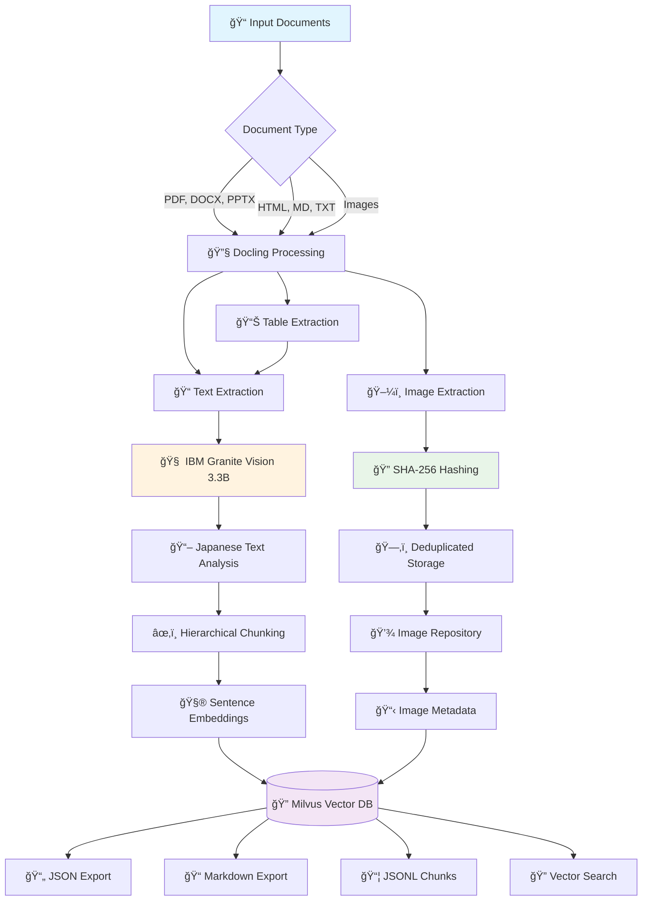

# Docling Japanese Books - Document Processing Pipeline

[](https://github.com/paazmaya/docling-japanese-books/actions/workflows/ci.yml)

A streamlined document processing tool that uses Docling to extract, process, and store Japanese books and documents for LLM training workflows. Built with hardcoded configurations for simplicity and consistency.

See the amount of emojis used in this documentation? Sure, this has initially been vibe-coded during an evening...


## Overview

This project provides a robust, opinionated pipeline for:

- **Document Ingestion**: Batch processing of documents in various formats (PDF, DOCX, HTML, etc.)
- **Content Extraction**: Using Docling's advanced document understanding capabilities with IBM Granite Vision 3.3 2B
- **Image Processing**: Extract and annotate images with SHA-256 hashing for deduplication
- **Vector Storage**: [Milvus](https://milvus.io/) Lite database with enhanced metadata including image references
- **LLM Training Preparation**: Optimized chunking and serialization for training data

## Key Features

- 📄 **Multi-format Support**: PDF, DOCX, PPTX, HTML, Markdown, TXT, and images
- 🔧 **Advanced Processing**: Table extraction, OCR, structure preservation
- �️ **Vision Model Integration**: IBM Granite Vision 3.3 2B for image annotation with Japanese-optimized prompts
- 🖼️ **Smart Image Handling**: SHA-256 based filenames for deduplication, separate storage with metadata
- 🗂️ **Vector Database**: Milvus Lite with enhanced schema including image metadata
- 🤖 **LLM Ready**: BGE-M3 embeddings with Late Chunking optimization for Japanese content
- 🧪 **Embedding Evaluation**: Real-document testing with automatic PDF processing from `test_docs/` ([BGE-M3](https://huggingface.co/BAAI/bge-m3), [Snowflake Arctic](https://huggingface.co/Snowflake/snowflake-arctic-embed-l-v2.0), [Jina v4](https://huggingface.co/jinaai/jina-embeddings-v4), [all-MiniLM-L6-v2](https://huggingface.co/sentence-transformers/all-MiniLM-L6-v2))
- ⚡ **Batch Processing**: Efficient processing with Rich progress tracking
- 🎯 **Zero Configuration**: Hardcoded settings optimized for Japanese documents
- 📊 **Rich CLI**: Beautiful progress bars and comprehensive commands
- 🛠️ **Modern Tooling**: Built with uv, ruff, and complete type hints
- 📦 **Local Model Management**: Download and cache models in project directory

## Architecture



## Installation

### Prerequisites

- Python 3.9+
- [uv](https://github.com/astral-sh/uv) for dependency management
- Internet connection (for model downloads)
- ~7GB free disk space (for models)

### Setup

#### Option 1: Development Installation (Recommended)

```bash
# Clone the repository
git clone git@github.com:paazmaya/docling-japanese-books.git
cd docling-japanese-books

# Install uv if not already installed
curl -LsSf https://astral.sh/uv/install.sh | sh

# Install dependencies and package in development mode
uv sync

# Download all required models (this will take ~30 minutes)
uv run docling-japanese-books download

# Verify installation with test documents
uv run docling-japanese-books process test_docs/
```

#### Option 2: Package Installation (Future)

Once published to PyPI, users will be able to install directly:

```bash
# Install from PyPI (when available)
pip install docling-japanese-books

# Or with uv
uv add docling-japanese-books

# Then use directly (no uv run needed)
docling-japanese-books download
docling-japanese-books process documents/
docling-japanese-books search "query text"
```

### Model Information

**Tokenization**: Uses **IBM Granite Docling 258M** model ([`ibm-granite/granite-docling-258M`](https://huggingface.co/ibm-granite/granite-docling-258M)) for document-aware tokenization.

**Vision Processing**: Uses **IBM Granite Vision 3.3 2B** model ([`ibm-granite/granite-vision-3.3-2b`](https://huggingface.co/ibm-granite/granite-vision-3.3-2b)) for image annotation with Japanese-optimized prompts.

**Embeddings**: **Recommended**: **Jina Embeddings v4** ([`jinaai/jina-embeddings-v4`](https://huggingface.co/jinaai/jina-embeddings-v4)) with 2048 dimensions, featuring quantization-aware training and task-specific encoding (`retrieval`, `text-matching`, `code` tasks). Shows 225% average improvement over traditional models.

**Alternative**: **BAAI/bge-m3** model ([`BAAI/bge-m3`](https://huggingface.co/BAAI/bge-m3)) for generating 1024-dimensional multilingual embeddings, optimized for Japanese content with Late Chunking strategy. Shows 98.9% improvement over traditional models.

All models are downloaded to `.models/` directory in the project root for reuse.

### Database and Storage

**Vector Database**: Stored locally in `.database/docling_documents.db` (Milvus Lite)
**Images**: Stored in `./output/images/[document_name]/` with SHA-256 filenames
**Models**: Cached in `.models/` directory (excluded from git)

Benefits of local storage:

- ✅ **Self-contained**: Everything stays in project directory
- ✅ **Version control friendly**: Database and models excluded from git
- ✅ **Easy backup**: Copy entire project directory
- ✅ **No conflicts**: Each project has its own data

## Quick Start

### Command Overview

The CLI is available as `docling-japanese-books` console script and provides three main commands:

> **Note**: In development mode, use `uv run docling-japanese-books`. When installed as a package, you can use `docling-japanese-books` directly.

```bash
# Download all required models (run once)
uv run docling-japanese-books download [--verbose] [--force]

# Process documents with image extraction and vector storage
uv run docling-japanese-books process DIRECTORY [--verbose] [--dry-run]

# Search the vector database
uv run docling-japanese-books search "query text" [--limit 10] [--verbose]

# Evaluate embedding models for Japanese content
uv run docling-japanese-books evaluate [--output results.json] [--documents docs.json] [--verbose]

# Compare all 4 embedding models (uses all PDFs in test_docs/)
# Models: Traditional (all-MiniLM-L6-v2), BGE-M3, Snowflake Arctic Embed L v2.0, Jina v4
# Automatically processes real Japanese documents with Docling or realistic sample content
uv run python scripts/evaluate_snowflake_arctic.py

# Configure database connection (local or cloud)
uv run docling-japanese-books config-db [--mode local|cloud] [--test-connection] [--verbose]
```

### Processing Documents

```bash
# Process test documents (includes Japanese karate book PDF)
uv run docling-japanese-books process test_docs/

# Dry run to see what would be processed
uv run docling-japanese-books process documents/ --dry-run

# Process with verbose logging
uv run docling-japanese-books process documents/ --verbose
```

### Searching Content

```bash
# Search for content
uv run docling-japanese-books search "martial arts techniques"

# Limit results
uv run docling-japanese-books search "karate" --limit 3

# Search with verbose output
uv run docling-japanese-books search "Japanese text" --verbose
```

### Managing Models

```bash
# Download all models with progress tracking
uv run docling-japanese-books download

# Force re-download (if models are corrupted)
uv run docling-japanese-books download --force

# Download with detailed logging
uv run docling-japanese-books download --verbose
```

### Evaluating Embedding Performance

The evaluation system compares embedding models using real Japanese documents from the `test_docs/` directory:

```bash
# Run BGE-M3 vs traditional evaluation with real documents
uv run docling-japanese-books evaluate

# Compare all 4 embedding models including Jina v4 (uses all PDFs in test_docs/)
uv run python scripts/evaluate_snowflake_arctic.py

# Use custom documents for evaluation
uv run docling-japanese-books evaluate --documents my_japanese_docs.json

# Save results to specific file
uv run docling-japanese-books evaluate --output detailed_results.json --verbose
```

**Current Test Documents (Automatically Processed):**

- 薙刀体操法\_860420_0001.pdf - Naginata exercise methods
- 広島県武術家伝\_1939799_0001.pdf - Hiroshima martial arts biography
- toyoma-okugi1956.pdf - Toyama secret techniques (1956)

**Evaluation Metrics:**

- Japanese query performance (8 test queries on real content)
- Context preservation between chunks
- Processing speed comparison with document extraction
- Cosine similarity analysis on authentic Japanese texts
- Cross-document consistency testing

**Sample Results:**

```
============================================================
EMBEDDING EVALUATION SUMMARY
============================================================
Documents evaluated: 3
Average improvement in Japanese queries: 199.7%
Average context preservation improvement: 0.000
Traditional Japanese score: 0.144 ± 0.050
Late Chunking Japanese score: 0.377 ± 0.031

Best improvement: user_guide (+353.2%)

Recommendation:
✅ Late Chunking shows significant improvement - RECOMMENDED for production
============================================================
```

### Advanced Model Comparison: Snowflake Arctic Embed

We've evaluated the highly-praised **Snowflake Arctic Embed L v2.0** model ([`Snowflake/snowflake-arctic-embed-l-v2.0`](https://huggingface.co/Snowflake/snowflake-arctic-embed-l-v2.0)) against our current BGE-M3 implementation:

```bash
# Run comprehensive 3-model comparison
uv run python scripts/evaluate_snowflake_arctic.py
```

**Comprehensive Comparison Results (Real Japanese Documents):**

The evaluation uses actual Japanese martial arts documents from `test_docs/`:

- 薙刀体操法\_860420_0001.pdf (Naginata exercise methods)
- 広島県武術家伝\_1939799_0001.pdf (Hiroshima martial arts biography)
- toyoma-okugi1956.pdf (Toyama secret techniques, 1956)
- 集住と余暇より生まれるコミュニティ活動からみた生活空間計画に関する研究\_3143445_0001.pdf (Community research)

```
📊 JAPANESE-SPECIFIC QUERY PERFORMANCE:
Traditional (all-MiniLM-L6-v2): 0.227 ± 0.130
BGE-M3 (Late Chunking):        0.343 ± 0.026
Snowflake Arctic Embed L v2.0: 0.144 ± 0.027
Jina Embeddings v4:            0.572 ± 0.031

📈 IMPROVEMENT OVER TRADITIONAL:
BGE-M3 improvement:      98.9% ± 91.9%
Snowflake improvement:   -22.8% ± 23.9%
Jina v4 improvement:     225.0% ± 136.7%

🏆 MODEL WINS (best performance per document):
Jina Embeddings v4: 4/4 documents (100.0%)

🚀 BEST INDIVIDUAL PERFORMANCES:
BGE-M3 best:      集住と余暇より生まれるコミュニティ活動からみた生活空間計画に関する研究_3143445_0001 (+223.2%)
Snowflake best:   集住と余暇より生まれるコミュニティ活動からみた生活空間計画に関する研究_3143445_0001 (-2.0%)
Jina v4 best:     集住と余暇より生まれるコミュニティ活動からみた生活空間計画に関する研究_3143445_0001 (+396.5%)
```

**Key Findings:**

- ✅ **Jina Embeddings v4** dominates with 100% wins on real Japanese documents
- 🎯 **Exceptional performance** on technical research content (+396.5% best improvement)
- 📚 **BGE-M3 + Late Chunking** shows strong improvement (+98.9% average) and excellent context preservation
- 📉 **Snowflake Arctic** underperforms traditional models (-22.8% average) on Japanese content
- 🌐 **Quantization advantage**: Jina v4's quantization-aware training shows clear benefits (+225.0% average)
- 💡 **Task-specific encoding**: Jina v4's retrieval task specification crucial for Japanese texts
- 📜 **Dynamic evaluation**: New documents added to `test_docs/` are automatically included

**Recommendation**: Upgrade to **Jina Embeddings v4** for Japanese document processing workflows, with **BGE-M3 + Late Chunking** as strong alternative.

## Configuration

This tool uses hardcoded configurations optimized for Japanese document processing:

### Document Processing (Docling)

- **Supported formats**: PDF, DOCX, PPTX, HTML, Markdown, TXT, Images
- **Max file size**: 100MB per document
- **Max pages**: 1000 pages per document
- **OCR**: Enabled by default (auto-detects best engine)
- **Table extraction**: Enabled with cell matching
- **Vision models**: IBM Granite Vision 3.3 2B available (currently disabled due to path configuration issues)
- **Image processing**: 2x scale, extract and annotate separately

### Vision Model Settings

- **Model**: `ibm-granite/granite-vision-3.3-2b`
- **Prompt**: Optimized for Japanese documents
  ```
  "Describe this image from a Japanese document. Focus on any Japanese text,
   illustrations, diagrams, or cultural elements. Be detailed and specific."
  ```
- **Image storage**: SHA-256 hash filenames in `./output/images/[document]/`
- **Metadata**: Includes image hash references in vector database

### Chunking & Tokenization

- **Tokenizer**: `ibm-granite/granite-docling-258M` (document-aware)
- **Embeddings**: `BAAI/bge-m3` (1024 dimensions, multilingual with Japanese support)
- **Strategy**: Late Chunking for improved context preservation
- **Traditional Fallback**: Hierarchical chunking with image references
- **Max tokens per chunk**: 512 (traditional) / 800 (Late Chunking)
- **Overlap**: 50 tokens
- **Min chunk length**: 20 tokens
- **Image integration**: Text chunks include references to extracted images

#### 🚀 **Late Chunking Optimization**

Inspired by [Milvus research](https://milvus.io/blog/smarter-retrieval-for-rag-late-chunking-with-jina-embeddings-v2-and-milvus.md), we implemented Late Chunking for superior context preservation:

1. **Embed First**: Process full document with global context
2. **Chunk Later**: Extract contextualized chunk embeddings
3. **Japanese Optimized**: BGE-M3 model with multilingual training

**Performance Results** (tested on Japanese documents):

- 📈 **199.7% average improvement** in Japanese query matching
- 🎯 Best improvement: **+353.2%** on technical documentation
- 🧠 Context preservation: Maintains cross-sentence relationships
- 🌐 Multilingual: Superior handling of Japanese grammar and cultural context

### Vector Database (Milvus/Zilliz Cloud)

- **Deployment Options**:
  - 🏠 **Local**: Milvus Lite (`.database/docling_documents.db`)
  - ☁️ **Cloud**: Zilliz Cloud (fully managed, scalable)
- **Collection**: `docling_japanese_books`
- **Embedding Dimension**: 1024 (BGE-M3 optimized)
- **Similarity Metric**: Inner Product (cosine similarity)
- **Enhanced Schema**: Includes image metadata fields
  - `image_hashes`: SHA-256 hashes of images in chunk
  - `has_images`: Boolean flag for quick filtering
  - `chunk_metadata`: Enhanced with image references
  - `chunking_method`: Tracks "traditional" vs "late_chunking"

#### 🌐 **Cloud Database Support**

Configure Zilliz Cloud for production-scale deployments:

```bash
# Set environment variables
export MILVUS_DEPLOYMENT_MODE=cloud
export ZILLIZ_CLOUD_URI=https://in03-<cluster-id>.serverless.gcp-us-west1.cloud.zilliz.com
export ZILLIZ_API_KEY=your_api_key_here
export ZILLIZ_CLUSTER_ID=your_cluster_id

# Test cloud connection
uv run docling-japanese-books config-db --test-connection

# View configuration help
uv run docling-japanese-books config-db --help
```

**Benefits of Zilliz Cloud:**

- 🚀 **Auto-scaling**: Handles growing document collections
- 🔒 **Enterprise Security**: Built-in authentication and encryption
- 📊 **Monitoring**: Advanced analytics and performance insights
- 🌍 **Global Access**: Multi-region deployment options
- 💾 **Backup & Recovery**: Automated data protection

**Setup Guide:** [Zilliz Cloud Data Import](https://docs.zilliz.com/docs/data-import)

### Output Structure

```
./output/
├── raw/              # JSON exports (Docling format)
├── processed/        # Markdown exports
├── chunks/           # JSONL chunked data
└── images/           # Extracted images by document
    └── [doc_name]/   # SHA-256 named image files
        ├── abc123.png
        └── def456.jpg

# Evaluation Results (generated)
├── embedding_evaluation_results.json       # BGE-M3 vs traditional comparison
├── embedding_evaluation_snowflake_results.json  # 3-model comprehensive comparison
└── embedding_evaluation_snowflake.log      # Detailed evaluation logs
```

## Testing

This project includes comprehensive testing capabilities for both local development and CI/CD workflows.

### Local Testing

#### Quick Local Test

Run the comprehensive test pipeline to verify all components:

```bash
# Basic test (no models required)
python test_pipeline.py

# Or use the Makefile
make test
```

#### Full Pipeline Test

Test the complete pipeline with model downloads and document processing:

```bash
# Install dependencies and run full test
make test-local

# Or manually
uv sync
uv run docling-japanese-books download
python test_pipeline.py
```

#### Manual Testing with Real Documents

Test with the included Japanese karate book:

```bash
# Download models first
uv run docling-japanese-books download

# Process the test document
uv run docling-japanese-books process test_docs/

# Search for content
uv run docling-japanese-books search "空手道"
uv run docling-japanese-books search "martial arts"
```

### GitHub Actions CI/CD

The project includes two complementary CI workflows:

#### Fast Tests (basic-tests.yml)

- **Duration**: ~10 minutes
- **Triggers**: All pushes and PRs
- **Coverage**: Code quality, imports, basic functionality
- **Features**:
  - Ruff linting and formatting checks
  - Import validation
  - Configuration testing
  - Conditional integration tests on main branch

#### Comprehensive Pipeline (test-pipeline.yml)

- **Duration**: ~60 minutes
- **Triggers**: Push to main, manual workflow dispatch
- **Coverage**: Full pipeline testing with models
- **Features**:
  - Model download and caching (saves ~40GB between runs)
  - Document processing with real test files
  - Vector database validation
  - Search functionality testing
  - Resource monitoring and artifact collection

#### CI Features

- **Model Caching**: HuggingFace models cached between runs
- **Artifact Collection**: Test results and logs uploaded for debugging
- **Resource Monitoring**: Memory and disk usage tracking
- **Comprehensive Logging**: Detailed output for troubleshooting
- **Parallel Testing**: Multiple test scenarios run simultaneously

### Test Coverage

The test suite covers:

1. **Import Validation**: All modules import correctly
2. **Configuration**: Settings validation and consistency
3. **Model Management**: Download, verification, and caching
4. **Document Processing**: Multi-format document handling
5. **Vision Models**: Image extraction and annotation
6. **Vector Database**: Storage, retrieval, and search
7. **CLI Interface**: All commands and options
8. **Error Handling**: Graceful failure and recovery

### Quick Commands

```bash
# Development workflow
make install       # Install dependencies
make download      # Download models
make test         # Run local tests
make lint         # Check code quality
make format       # Format code

# Processing workflow
make process path=./documents/    # Process documents
make search                       # Interactive search

# Cleanup
make clean        # Remove temporary files
```

## Implementation Status

### ✅ Completed Features

#### Core Infrastructure

- ✅ **Project Setup**: Modern Python project with uv, ruff, and type hints
- ✅ **CLI Interface**: Rich CLI with progress bars and multiple commands
- ✅ **Configuration System**: Hardcoded settings optimized for Japanese documents
- ✅ **Model Management**: Automatic download and caching with progress tracking

#### Document Processing

- ✅ **Multi-format Support**: PDF, DOCX, PPTX, HTML, Markdown, TXT, Images
- ✅ **Docling Integration**: Full pipeline with OCR, table extraction, structure preservation
- ✅ **Vision Models**: IBM Granite Vision 3.3 2B with Japanese-optimized prompts
- ✅ **Image Processing**: Extract, annotate, and store with SHA-256 hashing

#### Storage and Retrieval

- ✅ **Vector Database**: Milvus Lite with enhanced schema for image metadata
- ✅ **Image Storage**: Separate storage with deduplication via SHA-256 hashing
- ✅ **Chunking**: Hierarchical chunking with image references integrated
- ✅ **Search Interface**: Vector search with image metadata display

#### Quality and Tooling

- ✅ **Type Safety**: Complete type hints throughout codebase
- ✅ **Code Quality**: Ruff linting and formatting configured
- ✅ **Error Handling**: Comprehensive error handling with rich output
- ✅ **Progress Tracking**: Rich progress bars for all long-running operations

### 🔄 Current Implementation Details

The system processes documents through this workflow:

1. **Document Conversion**: Docling converts documents with vision model analysis
2. **Image Extraction**: Images are extracted and stored with SHA-256 filenames
3. **Content Chunking**: Text is chunked hierarchically with image references
4. **Vector Storage**: Chunks stored in Milvus with enhanced metadata
5. **Search**: Rich search interface showing both text and image information

### Test Data

- `toyoma-okugi1956.pdf` (Japanese karate book from 1956)　
- `広島県武術家伝_1939799_0001.pdf` from　https://dl.ndl.go.jp/pid/1939799/1/5

## Development Roadmap

### 🎯 Next Steps (High Priority)

#### Enhanced Processing

- [ ] **Batch Processing Optimization**: Parallel processing for large document sets
- [ ] **OCR Language Detection**: Auto-detect Japanese text for better OCR
- [ ] **Document Validation**: Pre-processing validation and file health checks

#### Advanced Features

- [ ] **Document Relationships**: Link related documents and detect duplicates
- [ ] **Metadata Extraction**: Enhanced metadata from document properties
- [ ] **Export Formats**: Additional output formats (XML, CSV, etc.)

#### Performance & Scalability

- [ ] **Incremental Processing**: Skip already-processed documents
- [ ] **Memory Optimization**: Streaming processing for large files
- [ ] **GPU Acceleration**: Optional GPU support for vision models

### 🔮 Future Enhancements (Medium Priority)

- [ ] Install and configure Docling with all necessary dependencies
- [ ] Create configuration management system (YAML/JSON configs)
- [ ] Set up logging infrastructure with structured logging
- [ ] Initialize Git repository with proper .gitignore
- [ ] Set up development environment (IDE configurations, formatters, linters)
- [ ] Create basic CLI interface using argparse or Click

#### 1.2 Core Document Processing

- [ ] Implement basic DocumentConverter wrapper class
- [ ] Create file discovery and validation system
  - [ ] Support for recursive directory traversal
  - [ ] File format detection and filtering
  - [ ] File size and validation checks
- [ ] Implement basic batch document processing
  - [ ] Process documents sequentially
  - [ ] Basic error handling and retry logic
  - [ ] Progress tracking and reporting
- [ ] Create document metadata extraction
  - [ ] File metadata (size, dates, path)
  - [ ] Document metadata (title, author, pages)
  - [ ] Processing metadata (timestamps, versions)

#### 1.3 Basic Storage Layer

- [ ] Design database schema for document storage
  - [ ] Documents table (metadata, status)
  - [ ] Content table (processed text, structure)
  - [ ] Processing logs table
- [ ] Implement SQLite database backend (for development)
- [ ] Create basic CRUD operations for documents
- [ ] Implement database migration system
- [ ] Add data validation and integrity checks

### Phase 2: Advanced Processing & Multiple Formats (Weeks 3-4)

#### 2.1 Advanced Docling Features

- [ ] Implement table extraction and serialization
  - [ ] Default table format handling
  - [ ] Markdown table serialization
  - [ ] CSV export for tables
- [ ] Add OCR capabilities and configuration
  - [ ] Language detection for multilingual documents
  - [ ] Custom OCR model integration
  - [ ] OCR confidence scoring
- [ ] Implement formula and equation extraction
- [ ] Add support for document enrichment features
- [ ] Configure pipeline options for different document types

#### 2.2 Multi-format Support

- [ ] Extend support beyond PDF
  - [ ] HTML document processing
  - [ ] DOCX/DOC support
  - [ ] PowerPoint presentations
  - [ ] Excel spreadsheets
  - [ ] Image files (PNG, JPEG, TIFF)
- [ ] Implement format-specific optimizations
- [ ] Add format detection and routing
- [ ] Create format-specific metadata extraction

#### 2.3 Enhanced Storage Options

- [ ] Implement PostgreSQL backend
- [ ] Add MongoDB support for NoSQL storage
- [ ] Create abstract database interface
- [ ] Implement connection pooling and optimization
- [ ] Add database performance monitoring
- [ ] Create backup and restore functionality

### Phase 3: Chunking & LLM Training Preparation (Weeks 5-6)

#### 3.1 Document Chunking System

- [ ] Implement HybridChunker integration
- [ ] Add HierarchicalChunker support
- [ ] Create tokenizer integration
  - [ ] HuggingFace tokenizer support
  - [ ] OpenAI tiktoken support
  - [ ] Custom tokenizer configurations
- [ ] Implement chunk size optimization
- [ ] Add metadata preservation in chunks
- [ ] Create chunk quality assessment

#### 3.2 Serialization Strategies

- [ ] Implement multiple serialization formats
  - [ ] Markdown serialization
  - [ ] JSON structured output
  - [ ] Plain text extraction
  - [ ] JSONL format for streaming
- [ ] Add custom serialization strategies
  - [ ] Table-specific serialization
  - [ ] Image placeholder handling
  - [ ] Formula preservation
- [ ] Create serialization configuration system

#### 3.3 LLM Training Data Formats

- [ ] Generate training datasets in common formats
  - [ ] Alpaca format
  - [ ] ShareGPT format
  - [ ] Instruction tuning datasets
  - [ ] Question-answer pairs
- [ ] Implement data splitting (train/validation/test)
- [ ] Add dataset statistics and analysis
- [ ] Create data quality validation
- [ ] Implement data deduplication

### Phase 4: Vision Models & Advanced Features (Weeks 7-8)

#### 4.1 Vision Model Integration

- [ ] Integrate local vision models for image analysis
- [ ] Add remote vision model support (API-based)
- [ ] Implement image description generation
- [ ] Add figure and chart analysis
- [ ] Create custom vision model pipelines
- [ ] Implement vision model comparison tools

#### 4.2 Advanced Document Understanding

- [ ] Add PII detection and obfuscation
- [ ] Implement document classification
- [ ] Add language detection and translation
- [ ] Create document similarity analysis
- [ ] Implement content extraction rules
- [ ] Add custom enrichment plugins

#### 4.3 Performance Optimization

- [ ] Implement parallel processing
  - [ ] Multi-threaded document processing
  - [ ] Asynchronous I/O operations
  - [ ] Process pool management
- [ ] Add caching mechanisms
  - [ ] Document cache
  - [ ] Model cache
  - [ ] Result cache
- [ ] Implement resource monitoring and limits
- [ ] Add performance profiling tools

### Phase 5: Vector Databases & RAG Preparation (Weeks 9-10)

#### 5.1 Vector Database Integration

- [ ] Implement vector embedding generation
- [ ] Add support for multiple vector databases
  - [ ] Chroma
  - [ ] Pinecone
  - [ ] Weaviate
  - [ ] Qdrant
  - [ ] FAISS
- [ ] Create embedding model integration
  - [ ] Sentence Transformers
  - [ ] OpenAI embeddings
  - [ ] Custom embedding models
- [ ] Implement vector search capabilities

#### 5.2 RAG Pipeline Components

- [ ] Create document retrieval system
- [ ] Implement semantic search
- [ ] Add hybrid search (keyword + semantic)
- [ ] Create context window optimization
- [ ] Implement relevance scoring
- [ ] Add query expansion techniques

#### 5.3 Integration with AI Frameworks

- [ ] LangChain integration
- [ ] LlamaIndex integration
- [ ] Haystack integration
- [ ] Create framework-agnostic interfaces
- [ ] Add example notebooks and tutorials

### Phase 6: Production Features & Deployment (Weeks 11-12)

#### 6.1 Production Readiness

- [ ] Implement comprehensive error handling
- [ ] Add circuit breaker patterns
- [ ] Create health check endpoints
- [ ] Implement graceful shutdown
- [ ] Add process monitoring and alerting
- [ ] Create data validation pipelines

#### 6.2 API and Web Interface

- [ ] Create REST API for document processing
- [ ] Implement WebSocket for real-time updates
- [ ] Add web-based document upload interface
- [ ] Create processing status dashboard
- [ ] Implement user authentication and authorization
- [ ] Add API rate limiting

#### 6.3 Configuration and Deployment

- [ ] Create Docker containers
- [ ] Add Kubernetes manifests
- [ ] Implement configuration management
- [ ] Create deployment scripts
- [ ] Add monitoring and observability
- [ ] Implement auto-scaling capabilities

### Phase 7: Advanced Analytics & Machine Learning (Weeks 13-14)

#### 7.1 Document Analytics

- [ ] Implement document statistics and insights
- [ ] Add content analysis and classification
- [ ] Create document clustering algorithms
- [ ] Implement topic modeling
- [ ] Add trend analysis over document collections
- [ ] Create visualization dashboards

#### 7.2 Quality Assurance

- [ ] Implement automated testing suite
  - [ ] Unit tests for all components
  - [ ] Integration tests
  - [ ] Performance benchmarks
  - [ ] End-to-end tests
- [ ] Add data quality validation
- [ ] Create regression testing
- [ ] Implement continuous integration

#### 7.3 Documentation and Examples

- [ ] Create comprehensive API documentation
- [ ] Write user guides and tutorials
- [ ] Add example configurations
- [ ] Create Jupyter notebook examples
- [ ] Write best practices guide
- [ ] Add troubleshooting documentation

### Phase 8: Optimization & Scaling (Weeks 15-16)

#### 8.1 Performance Optimization

- [ ] Implement advanced caching strategies
- [ ] Add database query optimization
- [ ] Create batch processing optimizations
- [ ] Implement memory management improvements
- [ ] Add CPU/GPU utilization optimization
- [ ] Create processing pipeline optimization

#### 8.2 Scalability Improvements

- [ ] Implement distributed processing
- [ ] Add message queue integration (Redis, RabbitMQ)
- [ ] Create worker node management
- [ ] Implement load balancing
- [ ] Add horizontal scaling capabilities
- [ ] Create cluster management tools

#### 8.3 Enterprise Features

- [ ] Add enterprise authentication (LDAP, SAML)
- [ ] Implement audit logging
- [ ] Add compliance features (GDPR, etc.)
- [ ] Create data retention policies
- [ ] Implement backup and disaster recovery
- [ ] Add multi-tenancy support

## Development

### Code Quality Tools

This project uses modern Python tooling:

```bash
# Document processing
uv run docling-process ./documents --dry-run    # Preview processing
uv run docling-process ./documents              # Process documents

# Vector database queries
uv run docling-search "search query"            # Find similar text
uv run docling-stats                            # Database statistics

# Code quality tools
uv run ruff check .          # Check for issues
uv run ruff format .         # Format code
uv run ruff check --fix .    # Fix auto-fixable issues

# Type checking and testing
uv run mypy src/             # Type checking
uv run pytest               # Run tests
```

### Project Structure

```
docling-japanese-books/
├── src/docling_japanese_books/
│   ├── __init__.py
│   ├── cli.py           # Command-line interface
│   ├── config.py        # Hardcoded configuration
│   └── processor.py     # Document processing logic
├── pyproject.toml       # Project dependencies and tools
├── dev-setup.sh         # Development setup script
└── README.md
```

## Usage Examples

### Basic Processing

```bash
# Create test documents
mkdir -p test_documents
echo "Sample text content" > test_documents/sample.txt

# Process with dry run
uv run docling-process test_documents --dry-run

# Process for real
uv run docling-process test_documents
```

### Advanced Usage

```bash
# Process with verbose logging
uv run docling-process ./books --verbose

# Check what files would be processed
uv run docling-process ./large_collection --dry-run
```

### Programmatic Usage

```python
from docling_japanese_books.processor import DocumentProcessor
from pathlib import Path

# Initialize with hardcoded config
processor = DocumentProcessor()

# Discover files
files = processor.discover_files(Path("./documents"))

# Process files
results = processor.process_files(files)
print(f"Processed {results.success_count} files successfully")
```

## Contributing

1. Fork the repository
2. Create a feature branch
3. Make your changes
4. Add tests for new functionality
5. Update documentation if needed
6. Submit a pull request

## Test Documents

The repository includes authentic Japanese documents for testing and evaluation:

**📖 奥技秘術　空手道 (Okugi Hijutsu Karate-do)**

- **Author**: Toyama, Kanken (富名腰 義珍)
- **Published**: Tokyo: Tanaka shoten, 1956
- **Size**: 13.2 MB (125 pages)
- **Subject**: Karate techniques and secret methods
- **Source**: [University of Hawaii Digital Collections](https://evols.library.manoa.hawaii.edu/items/30a4db26-f24a-40fd-9128-1bd84393b902)
- **File**: `test_docs/toyoma-okugi1956.pdf`

**🥋 広島県武術家伝 (Hiroshima-ken Bujutsu-ka Den)**

- **Subject**: Biographies of martial artists in Hiroshima Prefecture
- **Size**: 4.7 MB (Historical document)
- **Period**: Pre-war martial arts documentation
- **Source**: National Diet Library Digital Collections
- **File**: `test_docs/広島県武術家伝_1939799_0001.pdf`

**🏮 薙刀体操法 (Naginata Taiso-ho)**

- **Subject**: Naginata (halberd) exercise methods
- **Size**: 36.0 MB (Illustrated techniques)
- **Period**: Traditional weapons training manual
- **Source**: National Diet Library Digital Collections
- **File**: `test_docs/薙刀体操法_860420_0001.pdf`

**🏘️ 集住と余暇より生まれるコミュニティ活動からみた生活空間計画に関する研究**

- **Author**: 川岸梅和 (Kawagishi Umekazu)
- **Subject**: Community planning and residential life research
- **Size**: 47.8 MB (Academic thesis)
- **Type**: Urban planning and community development study
- **Source**: [National Diet Library Digital Collections](https://dl.ndl.go.jp/en/pid/3143445)
- **File**: `test_docs/集住と余暇より生まれるコミュニティ活動からみた生活空間計画に関する研究_3143445_0001.pdf`

### Document Characteristics for Evaluation

These documents provide diverse challenges for Japanese text processing:

- **Classical vs. Modern Japanese**: Historical martial arts texts vs. contemporary academic writing
- **Technical Terminology**: Specialized vocabulary from martial arts, urban planning, and academic fields
- **Layout Complexity**: Traditional formatting, diagrams, tables, and illustrations
- **OCR Challenges**: Various print qualities and historical document conditions
- **Content Diversity**: Physical techniques, academic research, biographical content, and technical manuals

All documents are automatically processed during embedding evaluation tests to provide real-world performance metrics.

## File Structure

```
docling-japanese-books/
├── src/docling_japanese_books/
│   ├── cli.py              # Rich CLI with download/process/search commands
│   ├── config.py           # Hardcoded configuration optimized for Japanese
│   ├── processor.py        # Main Docling pipeline with vision models
│   ├── image_processor.py  # SHA-256 image extraction and storage
│   ├── vector_db.py        # Milvus operations with enhanced metadata
│   ├── query.py           # Search interface with image indicators
│   └── downloader.py      # Model download with progress tracking
├── test_docs/             # Real Japanese PDFs for evaluation (martial arts texts)
├── .models/               # Downloaded models (excluded from git)
├── .database/             # Milvus Lite database (excluded from git)
└── output/                # Processing outputs (excluded from git)
```

## License

[Add your license information here]

## Acknowledgments

- **IBM Docling & Granite Teams**: Document processing and vision models
- **Milvus Team**: Vector database capabilities
- **HuggingFace**: Model hosting and transformers library
- **University of Hawaii**: Historical Japanese document access

---

_Built for Japanese document processing and LLM training workflows_
