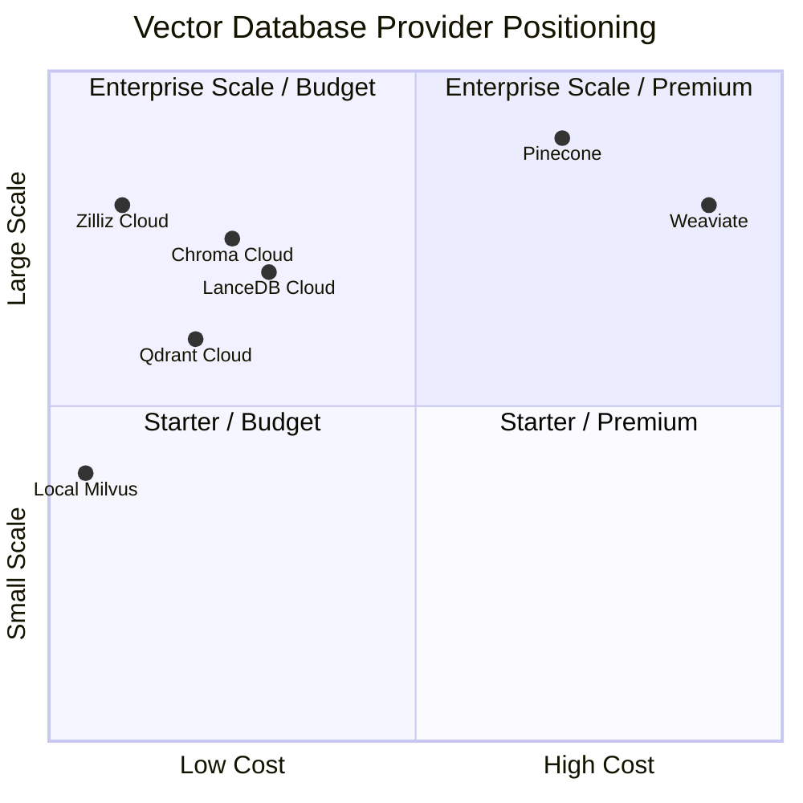

# Vector Database Provider Comparison

This document compares vector database providers for the **docling-japanese-books** project, focusing on storage requirements, costs, and capabilities for Japanese document processing.

## 📊 Provider Positioning Overview



**Quadrant Explanation:**

- **Q1 (Enterprise Scale / Premium)**: High-performance, feature-rich solutions for large deployments
- **Q2 (Enterprise Scale / Budget)**: Cost-effective solutions that can handle large scale
- **Q3 (Starter / Budget)**: Affordable options for small to medium projects
- **Q4 (Starter / Premium)**: High-cost solutions better suited for smaller, specialized use cases

## 📊 Storage Requirements Analysis

### Project Configuration

- **Target Content**: 80-page Japanese books
- **Chunking Strategy**: Late Chunking with ~400 characters per chunk
- **Overlap**: 10% between chunks for context preservation

### Storage Calculations per Book

| Content Type        | Chars/Page | Chunks/Book | Storage/Book | Books in 5GB |
| ------------------- | ---------- | ----------- | ------------ | ------------ |
| **Dense Classical** | 600        | 132 chunks  | 0.6 MB       | ~7,900       |
| **Mixed Content**   | 450        | 99 chunks   | 0.5 MB       | ~10,600      |
| **Modern Layout**   | 300        | 66 chunks   | 0.3 MB       | ~15,900      |

**Storage Breakdown per Chunk:**

- Vector embedding: 4KB (1024 dimensions × 4 bytes float32)
- Metadata: ~1KB (text content + document info)
- **Total per chunk**: ~5KB

## 🏢 Vector Database Provider Comparison

### 1. Zilliz Cloud (Recommended)

> **Sources**: [Zilliz Cloud Pricing](https://docs.zilliz.com/docs/pricing), [Zilliz Free Trials](https://docs.zilliz.com/docs/free-trials)

**Free Plan (Permanent):**

- ✅ **Storage**: 5GB free forever (enough for 1M 768-dim vectors)
- ✅ **Capacity**: 7,000-15,000 books (80 pages each)
- ✅ **Compute**: 2.5M vCUs per month
- ✅ **Collections**: Up to 5 collections
- ✅ **Features**: Full Serverless cluster features, Milvus compatibility
- ✅ **No Credit Card**: Required to start
- ✅ **Performance**: Enterprise-grade infrastructure
- ✅ **Integration**: Direct Milvus client support

**Free Trial (Additional):**

- 💰 **Credits**: $100 free credits for 30 days (with work email)
- ✅ **Access**: Serverless and Dedicated plans during trial
- ✅ **Extended**: Credits expire in 1 year if payment method added
- ⚠️ **After Trial**: Organization frozen, clusters moved to recycle bin (30-day recovery)

**Paid Tiers:**

- **Starter**: $0.10/GB/month + compute
- **Standard**: Volume discounts, dedicated resources
- **Enterprise**: Custom pricing, SLA guarantees

**Pros:**

- Native Milvus compatibility (no code changes needed)
- Excellent free tier for development/research
- Global CDN and edge locations
- Built-in backup and disaster recovery
- Advanced security features

**Cons:**

- Newer service (less market presence than some competitors)
- Pricing can scale up quickly for large datasets

### 2. Pinecone

> **Sources**: [Pinecone Pricing](https://www.pinecone.io/pricing/), [Pinecone Documentation](https://docs.pinecone.io/)

**Free Tier (Starter Plan - Permanent):**

- ✅ **Storage**: Up to 2GB free forever
- ✅ **Capacity**: ~4,000 books (80 pages each)
- ✅ **Write Units**: Up to 2M/month
- ✅ **Read Units**: Up to 1M/month
- ✅ **Index Types**: Dense and Sparse supported
- ✅ **Indexes**: Up to 5 indexes
- ✅ **Namespaces**: 100 per index
- ✅ **Embedding Models**: All available models included (5M tokens/month for select models)
- ✅ **Console Metrics**: Included
- ✅ **Users**: Up to 2 users per organization
- ⚠️ **Limitations**:
  - Single region only (AWS us-east-1)
  - No backups or restore functionality
  - Community support only (no SLA)
  - No SAML SSO, service accounts, or API key RBAC
  - No private endpoints or audit logs

**Free Trial (Standard Plan):**

- 💰 **Credits**: $300 credit for 3 weeks
- ✅ **Access**: All Standard plan features during trial
- ⚠️ **After Trial**: $50/month minimum + pay-as-you-go

**Paid Tiers:**

- **Standard**: $50/month minimum + pay-as-you-go
- **Enterprise**: Custom pricing with enhanced support and compliance features

**Current Pricing (Oct 2025):**

- Write Units: $0.4/1M writes
- Read Units: $0.5/1M reads
- Storage: Varies by region (~$0.096-0.128/GB/month)
- Additional features: SAML SSO, API key RBAC, object storage import

**Pros:**

- Mature platform with excellent performance
- Generous 2GB free tier (vs previous 100MB)
- Simple API and comprehensive documentation
- Built-in monitoring and metrics
- Strong ecosystem and integrations
- Multi-cloud availability (AWS, GCP, Azure)

**Cons:**

- Free tier limited to single region (us-east-1)
- $50/month minimum after trial period
- Can become expensive for high-volume applications
- Vendor lock-in (proprietary API)

### 3. Weaviate Cloud

> **Sources**: [Weaviate Pricing](https://weaviate.io/pricing), [Serverless Cloud](https://weaviate.io/deployment/serverless)

**Free Trial (Sandbox - 14 Days Only):**

- ⚠️ **Duration**: 14 days only (NOT permanent)
- ✅ **Features**: Full core DB toolkit during trial
  - Hybrid search (BM25 + vector)
  - Dynamic index
  - Compression and multi-tenancy
  - RBAC baseline security
- ✅ **Support**: Community support via Slack and Forum
- ❌ **After Trial**: Must upgrade to paid plan ($45/month minimum)
- ❌ **No Permanent Free Tier**: Trial only, no free forever option

**Paid Tiers (Serverless Cloud):**

- **Flex**: $45/month minimum (pay-as-you-go, shared cloud)
- **Plus**: $280/month minimum (prepaid, shared or dedicated)
- **Premium**: Custom pricing (dedicated infrastructure, white-glove support)

**Current Pricing (Nov 2025):**

For 10,000 books (1.02 billion vector dimensions):

- **Flex**: ~$760/month (estimated, usage-based)
- **Plus**: ~$280/month base + usage
- **Premium**: Custom pricing (enterprise)

**Pros:**

- Built-in hybrid search (BM25 + vector) out of the box
- GraphQL interface for complex queries
- Strong semantic capabilities and AI integrations
- Multiple SLA tiers with 24/7 support options
- Good open-source version available
- Quantization options (PQ, BQ) for cost optimization

**Cons:**

- No persistent free tier (14-day sandbox only)
- Expensive for large document collections ($122+/month minimum)
- More complex setup than Milvus/Pinecone
- Higher learning curve for GraphQL queries

### 4. Qdrant Cloud

> **Sources**: [Qdrant Pricing](https://qdrant.tech/pricing/), [Qdrant Calculator](https://cloud.qdrant.io/calculator)

**Free Tier (Permanent):**

- ✅ **Storage**: 1GB free forever cluster
- ✅ **Capacity**: ~2,600 books (80 pages each)
- ✅ **No Credit Card**: Required to start
- ✅ **Features**: Fully managed with all core features
  - Central cluster management
  - Multiple cloud providers (AWS, GCP, Azure) and regions
  - Horizontal & vertical scaling
  - Monitoring, logging, and alerting
  - High availability and auto-healing
  - Backup & disaster recovery
  - Zero-downtime upgrades
  - Unlimited users
  - Standard support and uptime SLAs
- ✅ **Performance**: Rust-based, very fast

**Paid Tiers:**

- **Hybrid Cloud**: $0.014/hour = $10.08/month base cluster + scaling costs
- **Private Cloud**: Custom pricing (enterprise)
- **Marketplace**: Available on AWS, GCP, and Azure marketplaces

**Current Pricing (Oct 2025):**

For 10,000 books (~4GB storage):

- **Base cluster**: $10.08/month (720 hours × $0.014)
- **Storage scaling**: ~$1.50/month (estimated 3GB overage × $0.50/GB)
- **Total estimated**: $11.58/month for 10K books

**Pros:**

- Excellent performance (Rust implementation)
- Best value free tier (1GB permanent vs competitors)
- Advanced filtering and search capabilities
- Open source with strong community
- Multi-cloud deployment options
- No vendor lock-in (can self-host)
- Built-in quantization and optimization features

**Cons:**

- Smaller managed cloud ecosystem compared to Pinecone/Weaviate
- Would require API migration from Milvus
- Scaling costs can vary significantly by configuration
- Less documentation for complex enterprise scenarios

### 5. Chroma Cloud

> **Sources**: [Chroma Pricing](https://www.trychroma.com/pricing), [Chroma Documentation](https://docs.trychroma.com/)

**Free Tier (Starter Plan):**

- ✅ **Credits**: $5 free credits + $0/month base
- ✅ **Usage-Based**: Pay only for what you use after credits
- ✅ **Capacity**: ~1,000-2,000 books with free credits
- ✅ **Features**: Vector, full-text, metadata search, Apache 2.0 open source
- ✅ **Team**: Up to 10 databases, 10 team members

**Pricing Model (Usage-Based):**

- **Writes**: $2.50 per GiB written
- **Storage**: $0.33 per GiB/month stored
- **Queries**: $0.0075 per TiB queried + $0.09 per GiB returned
- **Example**: $79/month for 1M docs written, 6M docs stored, 10M queries

**Paid Tiers:**

- **Team**: $250/month + usage, $100 credits included, up to 100 databases
- **Enterprise**: Custom pricing, unlimited databases, single tenant clusters

**Current Pricing (Nov 2025):**

For 10,000 books (~5GB storage, moderate usage):

- **Storage**: $1.65/month (5GB × $0.33)
- **Writes**: ~$12.50 (assuming 5GB written once)
- **Queries**: ~$8-15/month (moderate query volume)
- **Total estimated**: $20-30/month

**Pros:**

- Excellent open source foundation (Apache 2.0)
- Multi-modal search (vector, full-text, metadata, regex)
- Strong developer ecosystem and integrations
- Competitive pricing for storage and queries
- Easy local development with seamless cloud migration
- Built-in collaboration features and dashboard
- Strong community support (21k+ GitHub stars)

**Cons:**

- Newer cloud service (less mature than Pinecone/Weaviate)
- Would require API migration from Milvus
- Usage-based pricing can be unpredictable for high-volume applications
- Limited enterprise features compared to established providers

### 6. LanceDB Cloud

> **Sources**: [LanceDB Pricing](https://lancedb.com/pricing/), [LanceDB Cloud Docs](https://lancedb.com/docs/cloud/)

**Free Credits (One-Time Only):**

- 💰 **Credits**: $100 one-time free credits
- ⚠️ **Not Permanent**: Credits-based, no permanent free tier
- ✅ **Usage-Based**: Pay only for what you use (writes, queries, storage)
- ✅ **Capacity**: ~5,000-8,000 books with free credits
- ✅ **Features**: Serverless, multimodal storage, enterprise security
- ✅ **Migration**: Seamless from LanceDB OSS (just change connection URL)

**Pricing Model (Usage-Based):**

- **Writes**: $6.20 per 1M vectors written
- **Queries**: $15.26 per 1M queries
- **Storage**: $2.05 per GB/month
- **Total Example**: $23.50/month for 1M writes + 1M queries + moderate storage

**Current Pricing (Nov 2025):**

For 10,000 books (~5GB storage, moderate usage):

- **Storage**: $10.25/month (5GB × $2.05)
- **Writes**: $6.20 (assuming 1M vectors/month)
- **Queries**: $15.26 (assuming 1M queries/month)
- **Total estimated**: $31.71/month

**Pros:**

- True serverless with automatic scaling to zero
- Multimodal storage (vectors, text, images together)
- Lance columnar format for high performance
- Enterprise security (SOC2, HIPAA compliance)
- Open source compatibility (easy migration)
- Pay-per-use model (cost-effective for variable workloads)
- Built-in observability and monitoring
- $100 free credits for getting started

**Cons:**

- Newer service (public beta, GA coming soon)
- Usage-based pricing can be unpredictable for high-volume applications
- Query costs can add up with high traffic ($15.26/1M queries)
- Would require API migration from Milvus
- Limited documentation compared to established providers
- No permanent free tier (credits-based only)

### 7. Local Milvus Lite (Current Default)

**Costs:**

- ✅ **Storage**: Limited only by local disk space
- ✅ **Capacity**: Unlimited books (hardware dependent)
- ✅ **Features**: Full Milvus feature set

**Infrastructure Requirements:**

- **RAM**: 8GB+ recommended for large collections
- **Storage**: SSD recommended for performance
- **CPU**: Multi-core for embedding generation

**Pros:**

- Complete control and privacy
- No usage-based costs
- Full feature access
- Ideal for development and testing

**Cons:**

- No automatic scaling
- Manual backup and maintenance
- Single point of failure
- No built-in redundancy

## 🆓 Free Tier Detailed Comparison

This section provides a comprehensive analysis of free tier offerings to help you choose the best option for getting started without cost.

### Permanent Free Tiers

| Provider         | Storage | Capacity (Books) | Key Features                                          | Limitations                           | Best For                   |
| ---------------- | ------- | ---------------- | ----------------------------------------------------- | ------------------------------------- | -------------------------- |
| **Zilliz Cloud** | 5GB     | 7,000-15,000     | Full Serverless features, 2.5M vCUs/mo, 5 collections | None (full features)                  | Research, development      |
| **Pinecone**     | 2GB     | ~4,000           | 2M writes/mo, 1M reads/mo, 5 indexes, all embeddings  | Single region (us-east-1), no backups | Small projects, prototypes |
| **Qdrant**       | 1GB     | ~2,600           | Full managed features, multi-cloud, HA, backups       | Smaller storage capacity              | Cost-sensitive projects    |

### Trial Credits (No Permanent Free Tier)

| Provider     | Credits/Duration | After Trial       | Features During Trial              | Best For            |
| ------------ | ---------------- | ----------------- | ---------------------------------- | ------------------- |
| **Chroma**   | $5 one-time      | Pay-as-you-go     | Multi-modal search, open source    | Open source testing |
| **LanceDB**  | $100 one-time    | Pay-as-you-go     | Full serverless, multimodal        | Initial exploration |
| **Weaviate** | 14 days          | $45/month minimum | Full features, hybrid search       | Short-term testing  |
| **Zilliz**   | $100 (30 days)   | Free plan remains | Dedicated/Serverless plans (bonus) | Advanced testing    |

### Free Tier Feature Comparison

#### ✅ Zilliz Cloud Free Plan (Winner: Best Overall Free Tier)

**Why It's Best:**

- **Largest storage**: 5GB permanent (enough for 7,000-15,000 books)
- **No limitations**: Full Serverless features, no feature restrictions
- **Generous compute**: 2.5M vCUs per month included
- **Bonus**: Additional $100 trial credits for advanced features
- **No credit card**: Can start immediately
- **Production-ready**: Can be used for production workloads

**Use Cases:**

- Research projects with up to 15,000 books
- Development and testing environments
- Small production deployments
- Long-term free hosting for non-commercial projects

#### 🥈 Pinecone Starter Plan (Runner-up: Best Free Features)

**Why It's Good:**

- **Solid storage**: 2GB permanent (4,000 books)
- **Good throughput**: 2M writes/month, 1M reads/month
- **Full embeddings**: Access to all embedding models (5M tokens/month included)
- **Multiple indexes**: Up to 5 indexes supported
- **Mature platform**: Production-proven reliability

**Limitations:**

- Single region only (AWS us-east-1)
- No backup/restore functionality
- Community support only (no SLA)
- No advanced security features (SAML SSO, RBAC)

**Use Cases:**

- Prototypes and MVPs in us-east-1
- Small applications with <4,000 books
- Projects not requiring backups or multi-region
- Applications with moderate query volumes

#### 🥉 Qdrant Free Cluster (Best for Multi-Cloud)

**Why It's Good:**

- **Permanent**: 1GB free forever
- **Full features**: All managed cloud features included
- **Multi-cloud**: Available on AWS, GCP, Azure
- **Enterprise features**: HA, backups, monitoring included
- **No restrictions**: Full feature set, just smaller capacity

**Limitations:**

- Smallest storage (1GB = ~2,600 books)
- Need to scale to paid tier sooner

**Use Cases:**

- Small projects with <2,600 books
- Multi-region testing
- Cost-sensitive projects
- Learning and experimentation

#### ❌ Weaviate Sandbox (Not Recommended for Free Tier)

**Why It's Problematic:**

- **14 days only**: Not a permanent free tier
- **Forced upgrade**: Must pay $45/month after trial
- **No free option**: No way to continue without paying

**Only Good For:**

- Very short-term evaluation (14 days)
- Testing hybrid search features
- Enterprise POC with budget

#### ⚠️ LanceDB Free Credits (One-Time Only)

**Why It's Limited:**

- **One-time**: $100 credits expire, no permanent free tier
- **Usage-based**: Unpredictable costs after credits
- **Must pay**: No free tier after credits expire

**Good For:**

- Initial exploration and testing
- Evaluating multimodal features
- POC with lakehouse architecture

### Free Tier Recommendations Summary

**🏆 Best Overall Free Tier: Zilliz Cloud**

- 5GB permanent storage
- Full features, no restrictions
- Can host 7,000-15,000 books for free forever
- Production-ready
- **Winner for**: Research, development, small production

**🥈 Best Alternative: Pinecone Starter**

- 2GB permanent storage
- Good throughput and features
- Mature, reliable platform
- **Winner for**: US-based projects, proven reliability

**🥉 Best for Budget: Qdrant Free Cluster**

- 1GB permanent storage
- All enterprise features included
- Multi-cloud flexibility
- **Winner for**: Small projects, multi-cloud needs

**❌ Avoid for Free Tier: Weaviate**

- Only 14-day trial (not permanent)
- $45/month required after trial
- **Only use for**: Very short evaluations

**⚠️ Limited Value: Chroma Cloud**

- $5 one-time credits only (~1,000-2,000 books)
- No permanent free tier
- **Good for**: Open source enthusiasts, multi-modal search testing

**⚠️ Limited Value: LanceDB**

- $100 one-time credits only
- No permanent free tier
- **Only use for**: Initial testing, multimodal evaluation

## 🎯 Recommendations by Use Case

### 📚 Research/Academic Projects (5,000-15,000 books)

**Recommendation: Zilliz Cloud Free Plan (Permanent)**

- ✅ 5GB storage handles most research collections (7,000-15,000 books)
- ✅ **FREE FOREVER** - No cost for development and research
- ✅ Easy migration to paid tiers if needed
- ✅ Full Milvus compatibility
- ✅ No credit card required to start
- ✅ Production-ready features included

**Alternatives**:

- **Pinecone Starter**: 2GB free permanent (~4,000 books), limited to us-east-1
- **Qdrant Cloud**: 1GB free permanent (~2,600 books), multi-cloud support
- **Chroma Cloud**: $5 free credits (~1,000-2,000 books), open source foundation
- **LanceDB Cloud**: $100 credits for initial testing (not permanent)
- ⚠️ **Weaviate**: 14-day trial only, must pay $45/month after

### 🏢 Production Applications (>15,000 books)

**Recommendation: Zilliz Cloud Paid or Pinecone Standard**

- **Zilliz Cloud**: Better for Milvus compatibility, slightly lower cost
- **Pinecone**: Better for performance, mature ecosystem, $50-75/month range
- **LanceDB Cloud**: Good for variable workloads, serverless scaling, $30-50/month range
- **Chroma Cloud**: Open source foundation, multi-modal search, $20-30/month range
- Local Milvus Lite for development and testing
- Consider data partitioning strategies

### 💼 Small-Medium Production (5,000-15,000 books)

**Recommendation: Qdrant Cloud or Zilliz Cloud**

- **Qdrant**: $10-12/month, excellent Rust performance, cost-effective scaling
- **Zilliz Cloud**: Free tier possible, better for budget-conscious projects
- **Chroma Cloud**: $20-30/month, strong open source foundation, multi-modal search
- **LanceDB Cloud**: $30-35/month, serverless with multimodal capabilities
- **Pinecone**: $50/month minimum, excellent performance, proven reliability
- All offer enterprise-grade reliability and support

### 💻 Development/Testing

**Recommendation: Local Milvus Lite**

- ✅ Zero cost for development
- ✅ Full feature compatibility
- ✅ Fast iteration and testing
- Easy migration to cloud when ready

### 🔬 Experimental/Prototyping

**Recommendation: Multiple Providers**

- Start with Local Milvus Lite for development
- Test with Zilliz Cloud free tier
- Try LanceDB Cloud with $100 free credits for serverless testing
- Experiment with Chroma Cloud for open source compatibility
- Evaluate others based on specific requirements

## 🚀 Migration Strategy

### Phase 1: Development (Current)

```bash
# Local development with Milvus Lite
uv run docling-japanese-books config-db --mode local
```

### Phase 2: Cloud Testing

```bash
# Test with Zilliz Cloud free tier
export ZILLIZ_CLOUD_URI="your-cluster-uri"
export ZILLIZ_API_KEY="your-api-key"
uv run docling-japanese-books config-db --mode cloud --test-connection
```

### Phase 3: Production Scaling

- Monitor usage and performance
- Implement data partitioning if needed
- Consider hybrid deployment for optimal costs

### Getting Started with LanceDB Cloud

```bash
# Sign up and get API key
# Visit: https://accounts.lancedb.com/sign-up

# Install LanceDB SDK
pip install lancedb

# Connect to LanceDB Cloud
export LANCEDB_API_KEY="your-api-key"
export LANCEDB_URI="db://your-project-name"
```

**Configuration Example:**

```python
import lancedb

# Connect to LanceDB Cloud
db = lancedb.connect("db://your-project-name")

# Create table with embeddings
table = db.create_table("documents", [
    {"id": 1, "text": "sample", "vector": [0.1, 0.2, ...]}
])

# Search vectors
results = table.search([0.1, 0.2, ...]).limit(10).to_list()
```

**Migration from Local:**

LanceDB offers seamless migration from OSS to Cloud by simply changing the connection URL - no code changes required.

### Getting Started with Chroma Cloud

```bash
# Sign up for Chroma Cloud
# Visit: https://www.trychroma.com/signup

# Install Chroma
pip install chromadb

# Get API key from dashboard
export CHROMA_API_KEY="your-api-key"
export CHROMA_URL="https://your-tenant.trychroma.com"
```

**Configuration Example:**

```python
import chromadb

# Connect to Chroma Cloud
client = chromadb.HttpClient(
    host="your-tenant.trychroma.com",
    port=443,
    ssl=True,
    headers={"Authorization": f"Bearer {api_key}"}
)

# Create collection
collection = client.create_collection("documents")

# Add documents with embeddings
collection.add(
    documents=["sample text"],
    embeddings=[[0.1, 0.2, ...]],
    metadatas=[{"source": "book1.pdf"}],
    ids=["doc1"]
)

# Search
results = collection.query(
    query_embeddings=[[0.1, 0.2, ...]],
    n_results=10
)
```

**Migration from Local:**

Chroma offers seamless migration from local development to cloud with the same API - just change the client configuration.

## 📈 Cost Projections

### Storage Costs (per 10,000 books ≈ 5GB)

> **Sources**: [Zilliz Cloud Pricing](https://docs.zilliz.com/docs/pricing), [Pinecone Pricing](https://www.pinecone.io/pricing/), [Weaviate Pricing](https://weaviate.io/pricing), [LanceDB Pricing](https://lancedb.com/pricing/), [Chroma Pricing](https://www.trychroma.com/pricing)

| Provider         | Monthly Cost    | Annual Cost | Notes                           |
| ---------------- | --------------- | ----------- | ------------------------------- |
| **Zilliz Cloud** | $0 (free) → $50 | $0 → $600   | 5GB free tier → Standard        |
| **Qdrant**       | $0 → $12        | $0 → $144   | 1GB free tier, $10/month base   |
| **Chroma**       | $0 → $25        | $0 → $300   | $5 free credits → usage-based   |
| **LanceDB**      | $0 → $32        | $0 → $384   | $100 free credits → usage-based |
| **Pinecone**     | $50-75          | $600-900    | 2GB free, $50/month minimum     |
| **Weaviate**     | $122+           | $1,467+     | No free tier, $45/month minimum |
| **Local Milvus** | $20-50          | $240-600    | Hardware/hosting only           |

### Performance Considerations

| Provider         | Latency  | Throughput | Scalability | Maintenance |
| ---------------- | -------- | ---------- | ----------- | ----------- |
| **Zilliz Cloud** | Low      | High       | Excellent   | None        |
| **Pinecone**     | Very Low | Very High  | Excellent   | None        |
| **Qdrant**       | Very Low | Very High  | Good        | None        |
| **Chroma**       | Low      | High       | Excellent   | None        |
| **LanceDB**      | Low      | High       | Excellent   | None        |
| **Weaviate**     | Low      | High       | Good        | None        |
| **Local Milvus** | Very Low | Medium     | Manual      | High        |

## 🔧 Implementation Notes

### Current Project Support

The **docling-japanese-books** project currently supports:

- ✅ Local Milvus Lite
- ✅ Zilliz Cloud
- ❌ Other providers (would require API adapters)

### Adding New Providers

To add support for other providers:

1. Create provider-specific client adapters
2. Implement common interface in `vector_db.py`
3. Add configuration options in `config.py`
4. Update CLI commands for provider selection

### Configuration Examples

```python
# Zilliz Cloud
config = DatabaseConfig(
    deployment_mode='cloud',
    zilliz_cloud_uri='https://your-cluster.cloud.zilliz.com',
    zilliz_api_key='your-api-key'
)

# Local Milvus
config = DatabaseConfig(
    deployment_mode='local',
    database_path='./milvus_data'
)
```

## 📋 Conclusion

For the **docling-japanese-books** project processing 80-page Japanese books:

1. **🏆 Best Free Option**: Zilliz Cloud (5GB permanent = 7,000-15,000 books FREE forever)
2. **🥈 Best Free Alternative**: Pinecone (2GB permanent = ~4,000 books)
3. **🥉 Budget Free Option**: Qdrant (1GB permanent = ~2,600 books)
4. **Best Development**: Local Milvus Lite (unlimited, no cloud provider costs)
5. **Best Paid (Small-Medium)**: Qdrant ($10-12/month) or Chroma ($20-25/month)
6. **Best Production (Large Scale)**: Zilliz Cloud paid tiers (better cost efficiency)
7. **Best Performance**: Pinecone or local setup with SSD storage
8. **Best Multimodal**: LanceDB (lakehouse architecture, native multimodal support)
9. **Best Open Source**: Chroma (Apache 2.0, strong community, multi-modal search)
10. **⚠️ Avoid for Free**: Weaviate (14-day trial only, $45/month required)

### Cost-Performance Analysis:

| Provider     | 10K Books Cost | Free Tier     | Best For                        |
| ------------ | -------------- | ------------- | ------------------------------- |
| Zilliz Cloud | $0-50/month    | 5GB permanent | Budget projects, research       |
| Qdrant       | $0-12/month    | 1GB permanent | Cost-effective production       |
| Chroma       | $0-25/month    | $5 credits    | Open source, multi-modal search |
| LanceDB      | $0-32/month    | $100 credits  | Variable workloads, multimodal  |
| Pinecone     | $50-75/month   | 2GB permanent | Production reliability          |
| Weaviate     | $122+/month    | 14-day only   | Advanced hybrid search          |

The current dual-mode implementation (local + Zilliz Cloud) provides the optimal balance of development flexibility and production scalability at **zero cost for most projects**, with Qdrant, Chroma, and LanceDB as competitive cost-effective alternatives for larger deployments, Pinecone for production reliability in the US, and Weaviate for specialized hybrid search needs (though it lacks a permanent free tier).

## 📚 Sources & Validation

All pricing information was gathered from official sources in November 2025:

### Primary Pricing Sources:

- **Zilliz Cloud**: [https://docs.zilliz.com/docs/pricing](https://docs.zilliz.com/docs/pricing)
- **Zilliz Free Trials**: [https://docs.zilliz.com/docs/free-trials](https://docs.zilliz.com/docs/free-trials)
- **Qdrant**: [https://qdrant.tech/pricing/](https://qdrant.tech/pricing/)
- **Qdrant Calculator**: [https://cloud.qdrant.io/calculator](https://cloud.qdrant.io/calculator)
- **Chroma**: [https://www.trychroma.com/pricing](https://www.trychroma.com/pricing)
- **LanceDB**: [https://lancedb.com/pricing/](https://lancedb.com/pricing/)
- **Pinecone**: [https://www.pinecone.io/pricing/](https://www.pinecone.io/pricing/)
- **Weaviate**: [https://weaviate.io/pricing](https://weaviate.io/pricing)
- **Weaviate Serverless**: [https://weaviate.io/deployment/serverless](https://weaviate.io/deployment/serverless)

### Documentation Sources:

- **Chroma Documentation**: [https://docs.trychroma.com/](https://docs.trychroma.com/)
- **Chroma Cloud Docs**: [https://docs.trychroma.com/cloud/getting-started](https://docs.trychroma.com/cloud/getting-started)
- **LanceDB Cloud Docs**: [https://lancedb.com/docs/cloud/](https://lancedb.com/docs/cloud/)
- **LanceDB Documentation**: [https://lancedb.com/docs/](https://lancedb.com/docs/)
- **Weaviate Cloud Docs**: [https://docs.weaviate.io/cloud](https://docs.weaviate.io/cloud)
- **Pinecone Documentation**: [https://docs.pinecone.io/](https://docs.pinecone.io/)
- **Pinecone Billing Guide**: [https://docs.pinecone.io/guides/organizations/manage-billing/understand-billing](https://docs.pinecone.io/guides/organizations/manage-billing/understand-billing)
- **LanceDB Documentation**: [https://lancedb.com/docs/](https://lancedb.com/docs/)
- **Milvus Documentation**: [https://milvus.io/docs](https://milvus.io/docs)
- **Qdrant Documentation**: [https://qdrant.tech/documentation/](https://qdrant.tech/documentation/)

### Methodology & Analysis Process:

This comparison was conducted through systematic analysis:

1. **Data Gathering**: Official pricing pages and documentation analyzed (November 2025)
2. **Free Tier Verification**: Each provider's free tier terms verified from official sources
3. **Feature Comparison**: Free tier limitations documented from provider documentation
4. **Storage Calculations**: Based on BGE-M3 embeddings and Japanese text characteristics
5. **Cost Modeling**: Calculated realistic usage scenarios for 5GB-10GB document collections
6. **Validation**: Cross-referenced with multiple official sources and documentation

### Calculation Assumptions:

- **BGE-M3 embeddings**: 1024 dimensions per vector
- **Japanese books**: 80 pages, ~100 chunks per book (400-500 characters per page)
- **Storage per chunk**: ~5KB (4KB vector + 1KB metadata)
- **Usage patterns**: Moderate query volumes (1000-5000 queries/day)
- **Chunking strategy**: Late Chunking with 10% overlap for context preservation

### Price Analysis Scenarios:

- **Zilliz Cloud**:
  - Free Plan: 5GB permanent storage (1M 768-dim vectors, 2.5M vCUs/month, 5 collections)
  - Free Trial: $100 credits for 30 days for Serverless/Dedicated plans (bonus)
- **Pinecone**:
  - Starter: 2GB permanent free tier (2M writes/mo, 1M reads/mo, us-east-1 only)
  - Standard: $300 credit for 3-week trial, then $50/month minimum
- **Qdrant**:
  - Free: 1GB permanent cluster with full features
  - Hybrid Cloud: $0.014/hour base ($10.08/month minimum)
- **Chroma**:
  - One-time: $5 free credits for initial testing
  - Usage-based: $2.50/GiB writes, $0.33/GiB/month storage, $0.0075/TiB queries
- **LanceDB**:
  - One-time: $100 free credits for initial testing
  - Usage-based: $6.20/1M writes, $15.26/1M queries, $2.05/GB/month storage
- **Weaviate**:
  - Sandbox: 14-day trial only (NOT permanent)
  - Flex: $45/month minimum after trial (no free tier)
- **Local Milvus**: Hardware and hosting cost estimates only

**Note**: Pricing subject to change. Verify current rates on official provider websites before making decisions. This analysis reflects **November 2025** pricing and should be updated periodically.
